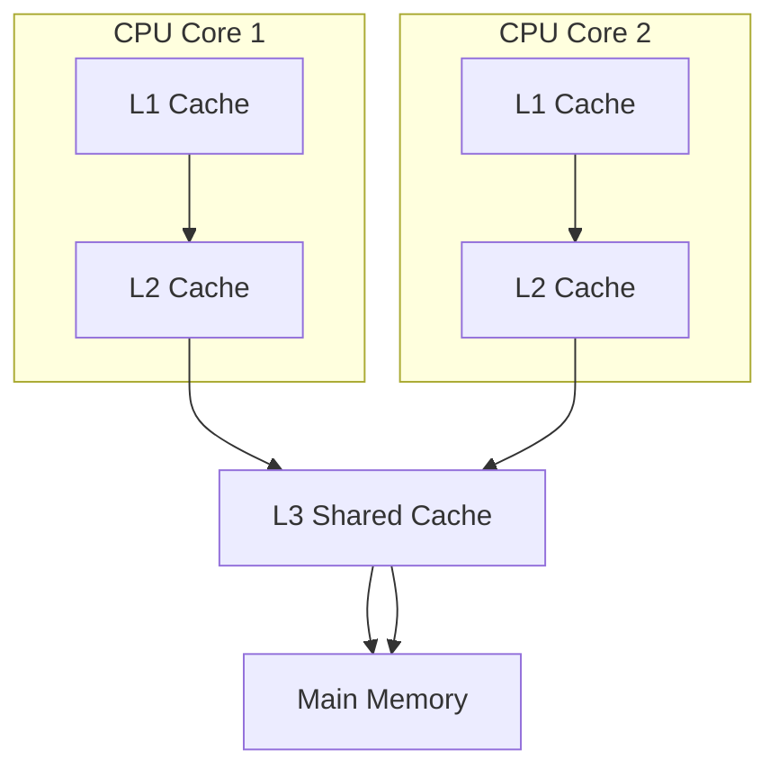

# 头文件

```c
#include <mutex>
#include <condition_variable>
#include <future>
#include <thread>
#include <atomic>
#include <shared_mutex>//C++14
#include <stop_token>//C++20
#include <barrier>	//C++20
#include <latch>	//C++20
#include <coroutine>//C++20
#include <semaphore>//C++20
```


## 关键字`thread_local` 

```c
thread_local int x = 1; // 每个线程都能够拥有自己的x互不影响
int y = 1;	//全局变量，每个线程共享
```

好的，这里是一份从 C++23 视角编写的关于进程、线程、协程区别的 Markdown 说明文档。

---

# 进程、线程与协程的区别（C++23 视角）

在 C++ 中，并发与并行编程主要通过进程、线程以及 C++20 引入的协程来实现。这三者在切换机制、资源占用和控制方式上有着根本性的不同。以下是它们之间核心区别的详细对比。

## 核心概念

*   **进程 (Process)**: 操作系统**资源分配**的基本单位。每个进程拥有独立的地址空间、文件描述符、安全上下文等。一个进程崩溃通常不会影响其他进程。
*   **线程 (Thread)**: 操作系统**CPU调度**的基本单位。它是进程内的一个执行流，**共享**其所属进程的地址空间和大部分资源。线程也被称为“轻量级进程”。
*   **协程 (Coroutine)**: **用户态**的、**协作式**的极轻量级线程。它由程序员或语言运行时（而非操作系统内核）管理，**共享**其所在线程的栈和所有资源。C++20 正式将协程引入语言标准。

## 对比总览

| 特性               | 进程 (Process)                                               | 线程 (Thread)                                                | 协程 (Coroutine)                                             |
| :----------------- | :----------------------------------------------------------- | :----------------------------------------------------------- | :----------------------------------------------------------- |
| **切换者**         | **操作系统内核**                                             | **操作系统内核**                                             | **用户代码 / 编译器生成的代码**                              |
| **切换时机**       | 时间片用完、系统调用、中断等 (**抢占式**)                    | 时间片用完、系统调用、中断等 (**抢占式**)                    | 主动 `co_await` 或 `co_yield` (**协作式**)                   |
| **切换内容**       | **完整上下文**：<br>1. 内存地址空间 (CR3)<br>2. 硬件上下文 (所有寄存器)<br>3. 内核数据结构 (PCB) | **硬件上下文**：<br>1. 寄存器组 (通用、PC、SP等)<br>2. 线程私有数据<br>3. **栈空间** (切换到新栈) | **少量寄存器**：<br>1. 程序计数器 (PC/RIP)<br>2. 栈指针 (SP/RSP)<br>3. 帧指针 (BP/RBP) 等 |
| **切换内容的保存** | 保存在操作系统内核的**进程控制块 (PCB)** 中                  | 保存在操作系统内核的**线程控制块 (TCB)** 中                  | 保存在**堆内存**上的 **协程帧 (Coroutine Frame)** 中         |
| **切换过程**       | **用户态 ↔ 内核态 ↔ 用户态**<br>代价**非常昂贵**             | **用户态 ↔ 内核态 ↔ 用户态**<br>代价**比较昂贵**             | **始终在用户态**完成<br>代价**极其低廉**                     |
| **资源隔离性**     | **完全隔离**，非常安全                                       | **共享内存**，需同步机制 (互斥锁等)                          | **完全共享**，需注意重入和生命周期                           |
| **C++标准支持**    | 无 (通过 `std::process` 等提案中)                            | **C++11** (`std::thread`)                                    | **C++20** (`co_await`, `co_yield`, `co_return`)              |
| **C++23 增强**     | -                                                            | `std::jthread` (自动 Join)                                   | `std::generator<>`, 标准库工具协程类型                       |

---

## 详细说明

### 1. 切换者 (Who does the switching?)

*   **进程 & 线程**：它们的切换完全由**操作系统内核**的调度器负责。应用程序通过系统调用（如 `fork`, `clone`）请求创建，但何时执行、何时挂起则由内核决定，对用户程序是“黑盒”。
*   **协程**：它的切换由**用户代码**和**编译器生成的代码**共同控制。当你执行 `co_await` 或 `co_yield` 时，你显式地指定了挂起点和恢复点。C++ 编译器会为你生成管理状态机和切换上下文的代码，整个过程**完全不经过操作系统内核**。

### 2. 切换时机 (When does the switch happen?)

*   **进程 & 线程**：采用**抢占式 (Preemptive)** 调度。内核维护一个任务队列，并为每个任务分配时间片。当一个任务的时间片用完、或执行了阻塞性系统调用（如 I/O）、或更高优先级任务就绪时，内核会**强制**中断当前任务并进行切换。这对程序员是透明的，但也带来了竞态条件和需要同步的问题。
*   **协程**：采用**协作式 (Cooperative)** 调度。**只有在协程函数内部显式地使用 `co_await` 或 `co_yield` 时，它才会主动挂起自己**，将执行权交还给调用者或另一个协程。如果协程内部有一个死循环而没有挂起点，它将永远不会主动让出执行权，导致线程被阻塞。

### 3. 切换内容与保存 (What is switched and where is it saved?)

*   **进程**：切换的是“整个世界”。这包括：
    *   **内存地址空间**：切换页表寄存器（如 x86 的 CR3），这意味着整个虚拟内存映射关系全部改变。
    *   **完整的硬件上下文**：所有CPU寄存器的状态。
    *   这些信息被保存在操作系统内核管理的**进程控制块 (PCB)** 数据结构中。
*   **线程**：切换发生在同一进程地址空间内。主要切换：
    *   **硬件执行上下文**：包括程序计数器、栈指针、通用寄存器等。
    *   **线程私有存储**。
    *   线程有自己的**栈空间**，切换时意味着栈指针（SP）要指向新线程的栈。
    *   这些信息被保存在内核的**线程控制块 (TCB)** 中。
*   **协程**：切换内容**最少**。主要保存和恢复**少数关键寄存器**，以表征当前的执行状态：
    *   **程序计数器 (RIP)**：当前执行到哪条指令了。
    *   **栈指针 (RSP)** 和**帧指针 (RBP)**：当前函数的栈帧位置。
    *   这些信息，连同协程的局部变量、挂起点等信息，一起被保存在**协程帧 (Coroutine Frame)** 中。这个帧是编译器在**堆 (Heap)** 上动态分配的一块内存。协程挂起时，状态存入协程帧；恢复时，从协程帧加载状态。**所有协程共享其所在线程的栈**。

### 4. 切换过程 (The switching process)

*   **进程/线程切换**：
    1.  从**用户态**陷入到**内核态**。
    2.  内核保存当前任务的上下文（到 PCB/TCB）。
    3.  内核调度算法选择下一个要运行的任务。
    4.  内核加载下一个任务的上下文。
    5.  从**内核态**返回到**用户态**，执行新任务。
    *   这个过程涉及**两次 CPU 特权级的切换**和大量数据的保存与恢复，**开销巨大**（通常需要微秒级）。
*   **协程切换**：
    1.  协程函数执行到 `co_await` 或 `co_yield`。
    2.  编译器生成的代码将当前寄存器状态**保存到堆上的协程帧**中。
    3.  编译器生成的代码**加载**另一个协程的状态**从它的协程帧到寄存器**。
    4.  跳转到另一个协程的恢复点继续执行。
    *   整个过程**完全在用户态**完成，不涉及系统调用，通常只是几条指令的开销（**纳秒级**）。

## C++23 代码示例意向

```cpp
// 进程 (伪代码，C++ 标准库没有直接支持)
// pid_t child_pid = fork();
// if (child_pid == 0) { /* 子进程 */ } else { /* 父进程 */ }

// 线程 (C++11)
#include <thread>
void worker() { /* ... */ }
std::thread t(worker); // 创建并启动线程
t.join();              // 等待线程结束

// 协程 (C++20)
#include <generator> // C++23 标准库协程工具

// 一个生成器协程
std::generator<int> sequence(int start, int end) {
    for (int i = start; i < end; ++i) {
        co_yield i; // 挂起并返回一个值，下次从此处恢复
    }
}

int main() {
    for (int num : sequence(1, 10)) { // 基于范围的 for 循环会自动 resume 协程
        std::cout << num << ' ';
    }
}
// 输出: 1 2 3 4 5 6 7 8 9
```

## 总结与选择

| 模型     | 优点                                                         | 缺点                                                     | 适用场景                                                     |
| :------- | :----------------------------------------------------------- | :------------------------------------------------------- | :----------------------------------------------------------- |
| **进程** | 稳定性高、隔离性好、安全性强                                 | 创建销毁慢、上下文切换开销最大、进程间通信(IPC)复杂      | 需要高度隔离和安全的任务（如浏览器标签、服务器 Worker 进程） |
| **线程** | 资源共享方便、通信简单(通过共享内存)、比进程轻量             | 需要复杂的同步机制防止数据竞争、上下文切换开销仍较大     | 需要充分利用多核CPU的计算密集型任务、IO密集型任务            |
| **协程** | **极致的轻量**（百万级）、**无锁同步**（单线程内）、切换开销极小 | **协作式**调度可能被滥用者阻塞、调试复杂、需要编译器支持 | **高并发**网络服务、异步IO、生成器、状态机、延迟计算         |

**简单比喻**：
*   **进程**是一个**独立的工厂**，有独立的场地（内存）、仓库（资源）和工人（线程）。
*   **线程**是同一个工厂里的**工人**，共享场地和仓库，但各自做不同的工作。
*   **协程**是同一个工人**同时处理多项任务**的能力，他可以在任务A做一会儿后，手动记录下来（挂起），然后切换到任务B，之后再回来从记录点继续做任务A。

# 一、`<mutex>`/`<shared_mutex>`

## 1. 概述

C++11 引入了多线程支持，其中 `<mutex>` 和 `<shared_mutex>` 头文件提供了多种互斥量和锁机制，用于线程同步和数据竞争防护。这些工具是现代C++并发编程的基础组件。

* mutex

| 类                                                           |                                                              |
| ------------------------------------------------------------ | ------------------------------------------------------------ |
| [ mutex](https://cppreference.cn/w/cpp/thread/mutex)(C++11)  | 提供基本的互斥设施  (类)                                     |
| [ timed_mutex](https://cppreference.cn/w/cpp/thread/timed_mutex)(C++11) | 提供互斥设施，实现带超时的锁定  (类)                         |
| [ recursive_mutex](https://cppreference.cn/w/cpp/thread/recursive_mutex)(C++11) | 提供互斥设施，可以被同一线程递归锁定  (类)                   |
| [ recursive_timed_mutex](https://cppreference.cn/w/cpp/thread/recursive_timed_mutex)(C++11) | 提供互斥设施，可以被递归锁定 被同一线程锁定并实现带超时的锁定  (类) |
| [ lock_guard](https://cppreference.cn/w/cpp/thread/lock_guard)(C++11) | 实现严格基于作用域的互斥体所有权包装器  (类模板)             |
| [ unique_lock](https://cppreference.cn/w/cpp/thread/unique_lock)(C++11) | 实现可移动的互斥体所有权包装器  (类模板)                     |
| [ scoped_lock](https://cppreference.cn/w/cpp/thread/scoped_lock)(C++17) | 用于多个互斥体的死锁避免 RAII 包装器  (类模板)               |
| [ once_flag](https://cppreference.cn/w/cpp/thread/once_flag)(C++11) | 确保 [`call_once`](https://cppreference.cn/w/cpp/thread/call_once) 只调用一次函数的辅助对象  (类) |
| 函数                                                         |                                                              |
| [ try_lock](https://cppreference.cn/w/cpp/thread/try_lock)(C++11) | 尝试通过重复调用 `try_lock` 来获取互斥体的所有权  (函数模板) |
| [ lock](https://cppreference.cn/w/cpp/thread/lock)(C++11)    | 锁定指定的互斥体，如果任何一个不可用则阻塞  (函数模板)       |
| [ call_once](https://cppreference.cn/w/cpp/thread/call_once)(C++11) | 即使从多个线程调用，也只调用一次函数  (函数模板)             |
| [ std::swap(std::unique_lock)](https://cppreference.cn/w/cpp/thread/unique_lock/swap2)(C++11) | 特化 [std::swap](https://cppreference.cn/w/cpp/algorithm/swap) 算法  (函数模板) |
| 标签                                                         |                                                              |
| [ defer_locktry_to_lockadopt_lockdefer_lock_ttry_to_lock_tadopt_lock_t](https://cppreference.cn/w/cpp/thread/lock_tag)(C++11) | 用于指定锁定策略的标签 (标签)                                |

* shared_mutex

| 类                                                           |                                                              |
| ------------------------------------------------------------ | ------------------------------------------------------------ |
| [ shared_mutex](https://cppreference.cn/w/cpp/thread/shared_mutex)(C++17) | 提供共享互斥设施  (类)                                       |
| [ shared_timed_mutex](https://cppreference.cn/w/cpp/thread/shared_timed_mutex)(C++14) | 提供共享互斥设施并实现带超时的锁定  (类)                     |
| [ shared_lock](https://cppreference.cn/w/cpp/thread/shared_lock)(C++14) | 实现可移动的共享互斥锁所有权包装器  (类模板)                 |
| 函数                                                         |                                                              |
| [ std::swap(std::shared_lock)](https://cppreference.cn/w/cpp/thread/shared_lock/swap2)(C++14) | 特化 [std::swap](https://cppreference.cn/w/cpp/algorithm/swap) 算法  (函数模板) |

## 2. 锁类型总览

### （1）互斥量类 (Mutex Types)

| 类型                         | C++版本 | 描述           | 特性               |
| ---------------------------- | ------- | -------------- | ------------------ |
| `std::mutex`                 | C++11   | 基本互斥量     | 不可递归，不可超时 |
| `std::timed_mutex`           | C++11   | 定时互斥量     | 不可递归，支持超时 |
| `std::recursive_mutex`       | C++11   | 递归互斥量     | 可递归，不可超时   |
| `std::recursive_timed_mutex` | C++11   | 定时递归互斥量 | 可递归，支持超时   |
| `std::shared_mutex`          | C++17   | 共享互斥量     | 支持读写锁语义     |
| `std::shared_timed_mutex`    | C++14   | 定时共享互斥量 | 支持读写锁和超时   |

### （2）锁包装器类 (Lock Wrappers)

| 类型               | C++版本 | 描述       | 特性                       |
| ------------------ | ------- | ---------- | -------------------------- |
| `std::lock_guard`  | C++11   | 作用域锁   | RAII风格，严格作用域绑定   |
| `std::unique_lock` | C++11   | 唯一锁     | 更灵活，可移动，可延迟锁定 |
| `std::shared_lock` | C++14   | 共享锁     | 用于共享互斥量的读取锁     |
| `std::scoped_lock` | C++17   | 作用域多锁 | 多互斥量死锁避免           |

## 3. 详细说明与示例代码

### （1）基本互斥量 (std::mutex)

最基本的互斥量类型，提供排他性访问。

```cpp
#include <iostream>
#include <mutex>
#include <thread>

std::mutex g_mutex;
int g_counter = 0;

void incrementCounter() {
    for (int i = 0; i < 100000; ++i) {
        g_mutex.lock();  // 手动锁定
        ++g_counter;
        g_mutex.unlock(); // 手动解锁
    }
}

int main() {
    std::thread t1(incrementCounter);
    std::thread t2(incrementCounter);
    
    t1.join();
    t2.join();
    
    std::cout << "Final counter value: " << g_counter << std::endl;
    return 0;
}
```

### （2）使用 lock_guard (RAII方式)

`lock_guard` 在构造时锁定互斥量，析构时自动解锁，避免忘记解锁。

```cpp
void safeIncrement() {
    for (int i = 0; i < 100000; ++i) {
        std::lock_guard<std::mutex> lock(g_mutex); // 构造时自动锁定
        ++g_counter;
        // lock析构时自动解锁
    }
}
```

### （3）使用 unique_lock (更灵活的RAII)

`unique_lock` 比 `lock_guard` 更灵活，支持延迟锁定、条件变量等。

```cpp
void flexibleIncrement() {
    for (int i = 0; i < 100000; ++i) {
        std::unique_lock<std::mutex> lock(g_mutex, std::defer_lock);
        // 手动决定何时锁定
        lock.lock();
        ++g_counter;
        // 可以提前解锁
        lock.unlock();
        
        // 执行一些不需要锁保护的操作
    }
}
```

### （4）定时互斥量 (std::timed_mutex)

支持带超时的锁定操作，避免无限期阻塞。

```cpp
#include <chrono>

std::timed_mutex g_timed_mutex;

void timedTask() {
    auto timeout = std::chrono::milliseconds(100);
    
    if (g_timed_mutex.try_lock_for(timeout)) {
        // 成功获取锁
        std::cout << "Thread " << std::this_thread::get_id() 
                  << " acquired the lock" << std::endl;
        std::this_thread::sleep_for(std::chrono::milliseconds(50));
        g_timed_mutex.unlock();
    } else {
        // 超时未获取锁
        std::cout << "Thread " << std::this_thread::get_id() 
                  << " could not acquire the lock" << std::endl;
    }
}
```

### （5）递归互斥量 (std::recursive_mutex)

允许同一线程多次锁定同一互斥量。

```cpp
std::recursive_mutex g_recursive_mutex;

void recursiveFunction(int depth) {
    std::lock_guard<std::recursive_mutex> lock(g_recursive_mutex);
    
    if (depth > 0) {
        std::cout << "Depth: " << depth << std::endl;
        recursiveFunction(depth - 1); // 递归调用，需要递归互斥量
    }
}
```

### （6）共享互斥量 (std::shared_mutex) - C++14/17

支持读写锁语义：多个读取者或一个写入者。

```cpp
#include <shared_mutex>

std::shared_mutex g_shared_mutex;
std::string g_shared_data;

void reader() {
    std::shared_lock<std::shared_mutex> lock(g_shared_mutex);
    // 多个线程可以同时持有共享锁
    std::cout << "Data: " << g_shared_data << std::endl;
}

void writer() {
    std::unique_lock<std::shared_mutex> lock(g_shared_mutex);
    // 只有一个线程可以持有独占锁
    g_shared_data = "Updated at " + std::to_string(time(nullptr));
}
```

### （7）多互斥量锁定 (std::lock 和 std::scoped_lock)

避免多锁情况下的死锁。

```cpp
std::mutex mutex1, mutex2;

void safeMultipleLock() {
    // C++17之前的方式
    std::lock(mutex1, mutex2); // 同时锁定，避免死锁
    std::lock_guard<std::mutex> lock1(mutex1, std::adopt_lock);
    std::lock_guard<std::mutex> lock2(mutex2, std::adopt_lock);
    
    // 执行操作
}

void saferMultipleLock() {
    // C++17方式（推荐）
    std::scoped_lock lock(mutex1, mutex2); // 自动避免死锁
    
    // 执行操作
}
```

### （8）调用一次 (std::call_once)

确保函数只被调用一次，即使多个线程尝试调用。

```cpp
std::once_flag g_once_flag;

void initialize() {
    std::cout << "Initialization called" << std::endl;
}

void threadFunction() {
    std::call_once(g_once_flag, initialize);
    // 其他操作
}
```

### （9）超时互斥锁方法对比try_lock_for 与 try_lock_until

* try_lock_for 与 try_lock_until

| 方法             | 参数类型               | 功能描述                         | 通俗理解                              |
| ---------------- | ---------------------- | -------------------------------- | ------------------------------------- |
| `try_lock_for`   | 相对时间（duration）   | 尝试获取锁，最多等待指定时间长度 | "我最多等你X时间，不管现在几点"       |
| `try_lock_until` | 绝对时间（time_point） | 尝试获取锁，最多等到指定时间点   | "我等到下午3点就不等了，不管要等多久" |

* 适用互斥锁类型

  - `std::timed_mutex`：支持超时的基本互斥锁

  - `std::recursive_timed_mutex`：支持超时的递归互斥锁

  - `std::shared_timed_mutex`：支持超时的共享互斥锁（C++14）

* 代码示例

```c
#include <iostream>
#include <mutex>
#include <shared_mutex>
#include <thread>
#include <chrono>

std::timed_mutex tmutex;
std::shared_timed_mutex smutex;

void timed_mutex_example() {
    // 尝试获取锁，最多等待100毫秒
    if (tmutex.try_lock_for(std::chrono::milliseconds(100))) {
        std::cout << "Thread " << std::this_thread::get_id() 
                  << " acquired timed_mutex with try_lock_for\n";
        std::this_thread::sleep_for(std::chrono::milliseconds(50));
        tmutex.unlock();
    } else {
        std::cout << "Thread " << std::this_thread::get_id() 
                  << " failed to acquire timed_mutex with try_lock_for\n";
    }

    // 尝试获取锁，最多等到当前时间+100毫秒
    auto timeout = std::chrono::steady_clock::now() + std::chrono::milliseconds(100);
    if (tmutex.try_lock_until(timeout)) {
        std::cout << "Thread " << std::this_thread::get_id() 
                  << " acquired timed_mutex with try_lock_until\n";
        std::this_thread::sleep_for(std::chrono::milliseconds(50));
        tmutex.unlock();
    } else {
        std::cout << "Thread " << std::this_thread::get_id() 
                  << " failed to acquire timed_mutex with try_lock_until\n";
    }
}

void shared_timed_mutex_example() {
    // 共享锁示例 - 多个读取者可以同时访问
    {
        // 尝试获取共享读锁
        if (smutex.try_lock_shared_for(std::chrono::milliseconds(100))) {
            std::cout << "Thread " << std::this_thread::get_id() 
                      << " acquired shared read lock\n";
            std::this_thread::sleep_for(std::chrono::milliseconds(30));
            smutex.unlock_shared();
        }
    }
    
    {
        // 尝试获取独占写锁
        auto timeout = std::chrono::steady_clock::now() + std::chrono::milliseconds(100);
        if (smutex.try_lock_until(timeout)) {
            std::cout << "Thread " << std::this_thread::get_id() 
                      << " acquired exclusive write lock\n";
            std::this_thread::sleep_for(std::chrono::milliseconds(30));
            smutex.unlock();
        }
    }
}

int main() {
    std::thread t1(timed_mutex_example);
    std::thread t2(timed_mutex_example);
    std::thread t3(shared_timed_mutex_example);
    std::thread t4(shared_timed_mutex_example);
    
    t1.join();
    t2.join();
    t3.join();
    t4.join();
    
    return 0;
}
```


### （10）锁策略`defer_lock`、`try_to_lock` 和 `adopt_lock`

* 参数对比表

| 参数          | 类型                 | 作用                       | 适用场景                               | 是否立即获取锁   |
| ------------- | -------------------- | -------------------------- | -------------------------------------- | ---------------- |
| `defer_lock`  | `std::defer_lock_t`  | 延迟获取锁，不立即锁定     | 需要稍后手动锁定或多个互斥量同时锁定时 | 否               |
| `try_to_lock` | `std::try_to_lock_t` | 尝试获取锁，但不阻塞       | 非阻塞的锁获取尝试，避免线程阻塞       | 尝试但不保证成功 |
| `adopt_lock`  | `std::adopt_lock_t`  | 假设调用方已拥有锁的所有权 | 管理已锁定的互斥量                     | 否（假设已锁定） |

* 详细说明与使用示例

#### a. `std::defer_lock`

**功能**：延迟锁的获取，构造时不立即锁定互斥量，允许稍后手动锁定。

**使用场景**：
- 需要同时锁定多个互斥量时（使用 `std::lock` 避免死锁）
- 需要更灵活的控制锁的获取时机

**示例代码**：
```cpp
#include <mutex>
#include <thread>

std::mutex mut1, mut2;

void process_data() {
    // 延迟锁定两个互斥量
    std::unique_lock<std::mutex> lock1(mut1, std::defer_lock);
    std::unique_lock<std::mutex> lock2(mut2, std::defer_lock);
    
    // 同时锁定两个互斥量（避免死锁）
    std::lock(lock1, lock2);
    
    // 临界区操作
    // ...
    
    // 自动解锁（RAII）
}

int main() {
    std::thread t1(process_data);
    std::thread t2(process_data);
    
    t1.join();
    t2.join();
    return 0;
}
```

#### b. `std::try_to_lock`

**功能**：尝试获取锁但不阻塞，如果锁不可用则立即返回。

**使用场景**：
- 非阻塞的锁获取尝试
- 避免线程阻塞，当锁不可用时执行替代操作

**示例代码**：
```cpp
#include <mutex>
#include <thread>
#include <iostream>

std::mutex mut;
int shared_data = 0;

void process_data() {
    // 尝试获取锁
    std::unique_lock<std::mutex> lock(mut, std::try_to_lock);
    
    if (lock.owns_lock()) {
        // 成功获取锁，执行临界区操作
        std::cout << "Thread " << std::this_thread::get_id() 
                  << " acquired lock, processing data: " << ++shared_data << std::endl;
    } else {
        // 未能获取锁，执行替代操作
        std::cout << "Thread " << std::this_thread::get_id() 
                  << " could not acquire lock, doing alternative work" << std::endl;
    }
}

int main() {
    std::thread t1(process_data);
    std::thread t2(process_data);
    
    t1.join();
    t2.join();
    return 0;
}
```

#### c. `std::adopt_lock`

**功能**：假设调用方已经拥有互斥量的锁，构造时不再尝试获取锁。

**使用场景**：
- 管理已经手动锁定的互斥量
- 将已有的锁交给 RAII 对象管理，确保异常安全

**示例代码**：

```cpp
#include <mutex>
#include <thread>
#include <iostream>

std::mutex mut;
int shared_data = 0;

void process_data() {
    // 手动锁定互斥量
    mut.lock();
    
    // 使用 adopt_lock 接管已锁定的互斥量
    std::unique_lock<std::mutex> lock(mut, std::adopt_lock);
    
    try {
        // 临界区操作
        std::cout << "Thread " << std::this_thread::get_id() 
                  << " processing data: " << ++shared_data << std::endl;
        
        // 可能抛出异常的操作
        if (shared_data > 5) {
            throw std::runtime_error("Data too large");
        }
    } catch (...) {
        // 异常发生时，锁会自动释放（RAII）
        throw;
    }
    
    // 锁在作用域结束时自动释放
}

int main() {
    std::thread t1(process_data);
    std::thread t2(process_data);
    
    t1.join();
    t2.join();
    return 0;
}
```

#### c. 综合使用示例

```cpp
#include <mutex>
#include <thread>
#include <iostream>
#include <vector>

std::mutex mut1, mut2;
int counter1 = 0, counter2 = 0;

void complex_operation() {
    // 使用 try_to_lock 尝试获取第一个锁
    std::unique_lock<std::mutex> lock1(mut1, std::try_to_lock);
    if (!lock1.owns_lock()) {
        std::cout << "Failed to acquire first lock, skipping operation" << std::endl;
        return;
    }
    
    // 成功获取第一个锁后，使用 defer_lock 延迟获取第二个锁
    std::unique_lock<std::mutex> lock2(mut2, std::defer_lock);
    
    // 执行一些不需要第二个锁的操作
    counter1++;
    
    // 现在获取第二个锁
    lock2.lock();
    counter2++;
    
    std::cout << "Counters: " << counter1 << ", " << counter2 << std::endl;
    
    // 如果需要，可以手动解锁
    lock1.unlock();
    
    // 执行一些不需要第一个锁的操作
    // ...
    
    // 重新获取锁
    lock1.lock();
    
    // 锁在作用域结束时自动释放
}

int main() {
    std::vector<std::thread> threads;
    for (int i = 0; i < 5; ++i) {
        threads.emplace_back(complex_operation);
    }
    
    for (auto& t : threads) {
        t.join();
    }
    
    return 0;
}
```

#### d. 注意事项

1. **`std::lock_guard` 的限制**：`std::lock_guard` 只能使用 `std::adopt_lock` 参数，不能使用 `defer_lock` 或 `try_to_lock`。

2. **异常安全**：使用 `std::unique_lock` 配合这些策略可以提供更好的异常安全性，确保锁在异常发生时正确释放。

3. **性能考虑**：`try_to_lock` 可以避免线程阻塞，但需要处理获取失败的情况，增加了代码复杂度。

4. **死锁避免**：使用 `defer_lock` 配合 `std::lock` 可以安全地同时锁定多个互斥量，避免死锁。


## 4. 总结与最佳实践

1. **优先使用RAII包装器**：如 `lock_guard`, `unique_lock`, `scoped_lock`，避免手动锁定/解锁
2. **根据需求选择互斥量类型**：
   - 基本需求：`std::mutex` + `std::lock_guard`
   - 需要超时：`std::timed_mutex` + `std::unique_lock`
   - 需要递归：`std::recursive_mutex`
   - 读写分离：`std::shared_mutex` + `std::shared_lock`/`std::unique_lock`
3. **锁定多个互斥量时**：使用 `std::scoped_lock` (C++17) 或 `std::lock` + `std::adopt_lock`
4. **只需初始化一次**：使用 `std::call_once` + `std::once_flag`

------


# 二、`<condition_variable>`

## 1. 概述

条件变量(`condition_variable`)是C++11中用于线程同步的重要工具，它允许线程在某些条件不满足时阻塞，并在条件可能满足时被其他线程唤醒。这种机制是实现生产者-消费者模式、线程间通信等高级同步模式的基础。

### （1）std::condition_variable

`std::condition_variable` 是与 `std::unique_lock<std::mutex>` 配合使用的条件变量实现。

主要方法：

| 方法                                                         | 描述                                    |
| ------------------------------------------------------------ | --------------------------------------- |
| `notify_one()`                                               | 唤醒一个等待的线程                      |
| `notify_all()`                                               | 唤醒所有等待的线程                      |
| `wait(unique_lock<mutex>& lock)`                             | 阻塞当前线程，直到被唤醒                |
| `wait(unique_lock<mutex>& lock, Predicate pred)`             | 带条件的等待，只有pred返回false时才阻塞 |
| `wait_for(unique_lock<mutex>& lock, const chrono::duration<Rep, Period>& rel_time)` | 相对超时等待                            |
| `wait_for(unique_lock<mutex>& lock, const chrono::duration<Rep, Period>& rel_time, Predicate pred)` | 带条件的相对超时等待                    |
| `wait_until(unique_lock<mutex>& lock, const chrono::time_point<Clock, Duration>& abs_time)` | 绝对超时等待                            |
| `wait_until(unique_lock<mutex>& lock, const chrono::time_point<Clock, Duration>& abs_time, Predicate pred)` | 带条件的绝对超时等待                    |

### （2）std::condition_variable_any

`std::condition_variable_any` 是一个更通用的条件变量实现，可以与任何满足基本锁要求的锁类型一起使用。

主要方法：

与 `std::condition_variable` 相同，但可以与任何锁类型配合使用。

### （3）std::cv_status

这是一个枚举类型，表示条件变量等待操作的结果：

| 值           | 描述                         |
| ------------ | ---------------------------- |
| `no_timeout` | 等待操作没有超时，条件已满足 |
| `timeout`    | 等待操作超时                 |

## 2. 示例代码与详细说明

### （1）基本生产者-消费者模式

```cpp
#include <iostream>
#include <queue>
#include <thread>
#include <mutex>
#include <condition_variable>

std::queue<int> data_queue;
std::mutex mtx;
std::condition_variable cv;
auto Pred = [&] { return !data_queue.empty(); };

void producer(int id) {
    for (int i = 0; i < 5; ++i) {
        std::unique_lock<std::mutex> lock(mtx);
        data_queue.push(i);
        std::cout << "Producer " << id << " produced: " << i << std::endl;
        lock.unlock();
        
        // 通知一个消费者
        cv.notify_one();
        
        std::this_thread::sleep_for(std::chrono::milliseconds(100));
    }
}

void consumer(int id) {
    while (true) {
        std::unique_lock<std::mutex> lock(mtx);
        
        // 使用带谓词的wait，避免虚假唤醒
        cv.wait(lock, Pred);
        
        int value = data_queue.front();
        data_queue.pop();
        std::cout << "Consumer " << id << " consumed: " << value << std::endl;
        
        lock.unlock();
        
        if (value == 4) break; // 简单终止条件
    }
}

int main() {
    std::thread p1(producer, 1);
    std::thread c1(consumer, 1);
    std::thread c2(consumer, 2);
    
    p1.join();
    c1.join();
    c2.join();
    
    return 0;
}
```

### （2）使用 wait_for 实现超时等待

```cpp
#include <iostream>
#include <thread>
#include <mutex>
#include <condition_variable>
#include <chrono>

std::mutex mtx;
std::condition_variable cv;
bool ready = false;

void worker() {
    std::this_thread::sleep_for(std::chrono::seconds(2));
    
    std::lock_guard<std::mutex> lock(mtx);
    ready = true;
    cv.notify_one();
}

int main() {
    std::thread t(worker);
    
    std::unique_lock<std::mutex> lock(mtx);
    
    // 等待最多3秒
    auto status = cv.wait_for(lock, std::chrono::seconds(3), []{ return ready; });
    
    if (status) {
        std::cout << "Worker completed in time" << std::endl;
    } else {
        std::cout << "Worker timed out" << std::endl;
    }
    
    t.join();
    return 0;
}
```

### （3）使用 condition_variable_any 与自定义锁

```cpp
#include <iostream>
#include <thread>
#include <mutex>
#include <condition_variable>

// 简单的自旋锁实现
class SpinLock {
public:
    void lock() {
        while (locked.test_and_set(std::memory_order_acquire)) {
            // 自旋等待
        }
    }
    
    void unlock() {
        locked.clear(std::memory_order_release);
    }
    
private:
    std::atomic_flag locked = ATOMIC_FLAG_INIT;
};

SpinLock spin_lock;
std::condition_variable_any cv;
bool data_ready = false;

void producer() {
    std::this_thread::sleep_for(std::chrono::seconds(1));
    
    {
        std::lock_guard<SpinLock> lock(spin_lock);
        data_ready = true;
    }
    
    cv.notify_one();
}

void consumer() {
    std::unique_lock<SpinLock> lock(spin_lock);
    cv.wait(lock, []{ return data_ready; });
    
    std::cout << "Data is ready!" << std::endl;
}

int main() {
    std::thread p(producer);
    std::thread c(consumer);
    
    p.join();
    c.join();
    
    return 0;
}
```

### （4）使用 notify_all_at_thread_exit

```cpp
#include <iostream>
#include <thread>
#include <mutex>
#include <condition_variable>

std::mutex mtx;
std::condition_variable cv;
bool ready = false;

void worker() {
    std::unique_lock<std::mutex> lock(mtx);
    ready = true;
    
    // 安排在线程退出时通知所有等待的线程
    std::notify_all_at_thread_exit(cv, std::move(lock));
}

int main() {
    std::thread t(worker);
    
    {
        std::unique_lock<std::mutex> lock(mtx);
        cv.wait(lock, []{ return ready; });
    }
    
    std::cout << "Worker thread has completed" << std::endl;
    
    t.join();
    return 0;
}
```

### （5）条件变量超时等待方法对比wait_for 与 wait_until

* wait_for 与 wait_until

| 方法         | 参数类型               | 功能描述                           | 通俗理解                              |
| ------------ | ---------------------- | ---------------------------------- | ------------------------------------- |
| `wait_for`   | 相对时间（duration）   | 等待条件成立，最多等待指定时间长度 | "我最多等你X时间，不管现在几点"       |
| `wait_until` | 绝对时间（time_point） | 等待条件成立，最多等到指定时间点   | "我等到下午3点就不等了，不管要等多久" |

* 代码示例

```c
#include <iostream>
#include <thread>
#include <mutex>
#include <condition_variable>
#include <chrono>

std::mutex mtx;
std::condition_variable cv;
bool ready = false;
int data = 0;

void producer() {
    std::this_thread::sleep_for(std::chrono::milliseconds(500));
    
    {
        std::lock_guard<std::mutex> lock(mtx);
        ready = true;
        data = 42;
        std::cout << "Producer: Data is ready\n";
    }
    
    cv.notify_all();
}

void consumer_wait_for() {
    std::unique_lock<std::mutex> lock(mtx);
    
    // 使用 wait_for - 最多等待1秒
    if (cv.wait_for(lock, std::chrono::seconds(1), []{ return ready; })) {
        std::cout << "Consumer (wait_for): Got data: " << data 
                  << " after waiting\n";
    } else {
        std::cout << "Consumer (wait_for): Timeout occurred\n";
    }
}

void consumer_wait_until() {
    std::unique_lock<std::mutex> lock(mtx);
    
    // 使用 wait_until - 最多等到当前时间+800毫秒
    auto timeout = std::chrono::steady_clock::now() + std::chrono::milliseconds(800);
    
    if (cv.wait_until(lock, timeout, []{ return ready; })) {
        std::cout << "Consumer (wait_until): Got data: " << data 
                  << " after waiting\n";
    } else {
        std::cout << "Consumer (wait_until): Timeout occurred\n";
    }
}

void consumer_with_predicate() {
    std::unique_lock<std::mutex> lock(mtx);
    
    // 使用带谓词的wait_for，避免虚假唤醒
    auto result = cv.wait_for(lock, std::chrono::milliseconds(300), 
                             []{ return ready; });
    
    if (result) {
        std::cout << "Consumer (predicate): Got data immediately: " << data << "\n";
    } else {
        std::cout << "Consumer (predicate): Condition not met within timeout\n";
    }
}

int main() {
    std::thread prod(producer);
    std::thread cons1(consumer_wait_for);
    std::thread cons2(consumer_wait_until);
    std::thread cons3(consumer_with_predicate);
    
    prod.join();
    cons1.join();
    cons2.join();
    cons3.join();
    
    return 0;
}
```


## 3. 重要概念与最佳实践

### （1）虚假唤醒 (Spurious Wakeup)

条件变量可能会在没有明显原因的情况下唤醒等待的线程，这称为"虚假唤醒"。为了防止这种情况，应该：

- 总是使用带有谓词条件的wait版本
- 谓词应该检查线程等待的实际条件

```cpp
// 正确的方式 - 使用谓词防止虚假唤醒
cv.wait(lock, []{ return !data_queue.empty(); });

// 错误的方式 - 容易受到虚假唤醒影响
while (data_queue.empty()) {
    cv.wait(lock);
}
```

### （2）条件变量的生命周期管理

条件变量必须在所有可能访问它的线程都结束后才能被销毁。通常，条件变量应该具有与使用它的线程相同的生命周期。

### （3）性能考虑

- 在可能的情况下，使用 `notify_one()` 而不是 `notify_all()`，以减少不必要的线程唤醒
- 在释放互斥锁之后调用通知函数，可以减少上下文切换
- 考虑使用超时版本的等待函数，避免永久阻塞

### （4）与互斥锁的配合

条件变量总是与互斥锁一起使用，以保护共享数据。典型的模式是：

1. 获取互斥锁
2. 检查条件
3. 如果条件不满足，等待条件变量（会自动释放锁）
4. 当被唤醒时，重新获取锁并再次检查条件
5. 处理共享数据
6. 释放锁

------


# 三、`<thread>` 

## 1. 概述

C++11 引入了 `std::thread` 类作为多线程编程的基础，而 C++20 进一步引入了 `std::jthread`（joining thread）类，提供了更安全和易用的线程管理机制。两者都定义在 `<thread>` 头文件中。

关于  `std::jthread` 使用的  `std::stop_source `，见第六章介绍

### （1）thread和jthread 主要区别对比

C++20 的 `std::jthread` 是对 C++11 `std::thread` 的重要改进，主要增加了：

1. **自动加入机制**：析构时自动等待线程结束，避免资源泄漏
2. **内置停止机制**：通过 `std::stop_token` 和 `std::stop_source` 提供协作式停止功能
3. **更安全的接口**：减少了需要显式管理线程生命周期的需求

对于新项目，推荐使用 `std::jthread`，除非有特定的兼容性要求。对于现有代码，可以考虑逐步迁移到 `std::jthread` 以获得更好的安全性和可维护性。

| 特性             | std::thread (C++11)                         | std::jthread (C++20)                                         |
| ---------------- | ------------------------------------------- | ------------------------------------------------------------ |
| **析构行为**     | 如果线程可连接时析构，调用 `std::terminate` | 如果线程可连接时析构，自动请求停止并等待线程结束             |
| **停止机制**     | 无内置停止机制，需自行实现                  | 内置停止请求机制，通过 `std::stop_token` 和 `std::stop_source` |
| **自动加入**     | 需要显式调用 `join()` 或 `detach()`         | 析构时自动加入（join），无需显式调用                         |
| **构造函数**     | 接受函数和参数                              | 除了接受函数和参数，还可接受带 `std::stop_token` 参数的函数  |
| **移动语义**     | 支持移动构造和移动赋值                      | 支持移动构造和移动赋值                                       |
| **复制语义**     | 不可复制                                    | 不可复制                                                     |
| **停止相关方法** | 无                                          | `get_stop_source()`, `get_stop_token()`, `request_stop()`    |

## 2. 详细说明与示例代码

### （1） std::thread 基本使用

```cpp
#include <iostream>
#include <thread>
#include <chrono>

void simple_worker(int id) {
    for (int i = 0; i < 5; ++i) {
        std::cout << "Thread " << id << " working: " << i << std::endl;
        std::this_thread::sleep_for(std::chrono::milliseconds(100));
    }
}

int main() {
    // 创建线程
    std::thread t1(simple_worker, 1);
    std::thread t2(simple_worker, 2);
    
    // 必须显式等待线程结束
    t1.join();
    t2.join();
    
    std::cout << "All threads completed" << std::endl;
    return 0;
}
```

### （2）std::thread 的潜在问题

```cpp
#include <iostream>
#include <thread>

void problematic_worker() {
    std::cout << "Working..." << std::endl;
}

void dangerous_example() {
    std::thread t(problematic_worker);
    
    // 如果此处抛出异常，t 将不会被 join
    // 导致程序调用 std::terminate
    
    // 正确做法是使用 try-catch 或 RAII 包装器
    t.join();
}

int main() {
    dangerous_example();
    return 0;
}
```

### （3）std::jthread 基本使用

```cpp
#include <iostream>
#include <thread>
#include <chrono>

void jthread_worker(int id) {
    for (int i = 0; i < 5; ++i) {
        std::cout << "JThread " << id << " working: " << i << std::endl;
        std::this_thread::sleep_for(std::chrono::milliseconds(100));
    }
}

int main() {
    {
        // jthread 在析构时会自动 join
        std::jthread t1(jthread_worker, 1);
        std::jthread t2(jthread_worker, 2);
        
        // 不需要显式调用 join()
        // 当离开作用域时，会自动等待线程结束
    }
    
    std::cout << "All jthreads completed" << std::endl;
    return 0;
}
```

### （4）std::jthread 的停止机制

```cpp
#include <iostream>
#include <thread>
#include <chrono>

void stoppable_worker(std::stop_token stoken, int id) {
    for (int i = 0; i < 100; ++i) {
        // 检查是否收到停止请求
        if (stoken.stop_requested()) {
            std::cout << "Thread " << id << " received stop request" << std::endl;
            return;
        }
        
        std::cout << "Thread " << id << " working: " << i << std::endl;
        std::this_thread::sleep_for(std::chrono::milliseconds(50));
    }
}

int main() {
    std::jthread t1(stoppable_worker, 1);
    std::jthread t2(stoppable_worker, 2);
    
    // 运行一段时间后请求停止
    std::this_thread::sleep_for(std::chrono::milliseconds(500));
    
    // 请求停止所有线程
    t1.request_stop();
    t2.request_stop();
    
    // 不需要显式 join，析构时会自动等待
    return 0;
}
```

### （5）使用 stop_callback 处理停止请求

```cpp
#include <iostream>
#include <thread>
#include <chrono>
#include <vector>
#include <latch>

void worker_with_callback(std::stop_token stoken, std::latch& start_latch) {
    // 注册停止回调
    std::stop_callback callback(stoken, []{
        std::cout << "Stop requested, performing cleanup..." << std::endl;
    });
    
    // 等待开始信号
    start_latch.wait();
    
    while (!stoken.stop_requested()) {
        std::cout << "Working..." << std::endl;
        std::this_thread::sleep_for(std::chrono::milliseconds(100));
    }
    
    std::cout << "Exiting worker" << std::endl;
}

int main() {
    const int num_workers = 3;
    std::latch start_latch(1); // 主线程控制开始
    
    std::vector<std::jthread> workers;
    
    for (int i = 0; i < num_workers; ++i) {
        workers.emplace_back(worker_with_callback, std::ref(start_latch));
    }
    
    // 让线程运行一段时间
    std::this_thread::sleep_for(std::chrono::milliseconds(500));
    
    // 发出开始信号
    std::cout << "Starting workers..." << std::endl;
    start_latch.count_down();
    
    // 让线程运行一段时间
    std::this_thread::sleep_for(std::chrono::milliseconds(1000));
    
    // 请求所有线程停止
    std::cout << "Requesting stop..." << std::endl;
    for (auto& t : workers) {
        t.request_stop();
    }
    
    // jthread 会自动 join
    return 0;
}

```

### （6）获取线程信息和硬件并发数

```cpp
#include <iostream>
#include <thread>
#include <vector>

void info_worker(int id) {
    std::cout << "Thread " << id << " ID: " << std::this_thread::get_id() << std::endl;
}

int main() {
    // 获取硬件支持的并发线程数
    unsigned int n_threads = std::thread::hardware_concurrency();
    std::cout << "Hardware concurrency: " << n_threads << std::endl;
    
    std::vector<std::jthread> threads;
    
    // 创建多个线程
    for (int i = 0; i < 3; ++i) {
        threads.emplace_back(info_worker, i);
    }
    
    // 不需要显式 join，vector 析构时会自动等待所有线程
    return 0;
}
```

### （7）线程移动语义

```cpp
#include <iostream>
#include <thread>
#include <vector>

void movable_worker(int id) {
    std::cout << "Movable thread " << id << std::endl;
}

int main() {
    std::vector<std::jthread> threads;
    
    // 创建线程并移动到 vector 中
    std::jthread t1(movable_worker, 1);
    std::jthread t2(movable_worker, 2);
    
    // 移动线程到容器中
    threads.push_back(std::move(t1));
    threads.push_back(std::move(t2));
    
    // 确认原线程对象不再拥有线程
    std::cout << "t1 joinable: " << t1.joinable() << std::endl;
    std::cout << "t2 joinable: " << t2.joinable() << std::endl;
    
    return 0;
}
```

------


# 四、`<future>`

## 1. 概述

`<future>` 头文件是 C++11 并发支持库的重要组成部分，提供了一套高级工具来处理异步操作和并发任务。这些工具允许开发者更容易地编写异步代码，而不需要直接处理线程管理和同步的复杂性。

### （1）std::promise 和 std::future

`std::promise` 和 `std::future` 是一对配合使用的类，用于在线程间传递结果。

- **std::promise**: 承诺在未来提供某个值
- **std::future**: 用于获取承诺的值

| 类/方法                   | 描述                                          |
| ------------------------- | --------------------------------------------- |
| `std::promise<T>`         | 创建一个承诺，可以在未来设置一个类型为 T 的值 |
| `promise.set_value()`     | 设置承诺的值                                  |
| `promise.set_exception()` | 设置承诺的异常                                |
| `promise.get_future()`    | 获取与承诺关联的 future 对象                  |
| `std::future<T>`          | 用于获取承诺的值                              |
| `future.get()`            | 获取值（如果尚未就绪，则阻塞）                |
| `future.wait()`           | 等待值就绪                                    |
| `future.wait_for()`       | 等待一段时间                                  |
| `future.wait_until()`     | 等待直到某个时间点                            |
| `future.valid()`          | 检查 future 是否有效                          |

### （2）std::packaged_task

`std::packaged_task` 包装一个可调用对象，并将其执行结果与一个 future 关联。

| 方法                         | 描述                         |
| ---------------------------- | ---------------------------- |
| `std::packaged_task<F>`      | 创建一个包装可调用对象的任务 |
| `packaged_task(args...)`     | 执行包装的函数               |
| `packaged_task.get_future()` | 获取与任务关联的 future      |

### （3）std::async

`std::async` 是一个函数模板，用于异步执行函数并返回一个 future。

| 参数/选项               | 描述                            |
| ----------------------- | ------------------------------- |
| `std::launch::async`    | 在新线程中异步执行              |
| `std::launch::deferred` | 延迟执行，直到调用 future.get() |
| 无策略参数              | 由实现决定执行方式              |

### （4）std::shared_future

`std::shared_future` 类似于 `std::future`，但可以被多个线程共享。

| 特点     | 描述                    |
| -------- | ----------------------- |
| 可复制   | 可以被多个对象引用      |
| 多次获取 | 可以多次调用 get() 方法 |

### （5）其他组件

- **std::future_status**: 表示等待操作的结果（ready, timeout, deferred）
- **std::future_error**: 与 future 操作相关的异常
- **std::future_errc**: future 错误代码枚举

## 2. 示例代码与详细说明

### （1）基本的 promise 和 future 使用

```cpp
#include <iostream>
#include <future>
#include <thread>
#include <chrono>

void producer(std::promise<int> prom) {
    std::cout << "Producer started..." << std::endl;
    std::this_thread::sleep_for(std::chrono::seconds(2)); // 模拟工作
    prom.set_value(42); // 设置承诺的值
    std::cout << "Producer finished" << std::endl;
}

int main() {
    std::promise<int> prom;
    std::future<int> fut = prom.get_future();
    
    // 启动生产者线程
    std::thread t(producer, std::move(prom));
    
    std::cout << "Main thread waiting for result..." << std::endl;
    int result = fut.get(); // 阻塞直到值可用
    
    std::cout << "Result: " << result << std::endl;
    
    t.join();
    return 0;
}
```

### （2）使用 packaged_task

```cpp
#include <iostream>
#include <future>
#include <thread>

int compute(int x, int y) {
    std::cout << "Computing..." << std::endl;
    return x * y;
}

int main() {
    // 创建一个 packaged_task，包装 compute 函数
    std::packaged_task<int(int, int)> task(compute);
    
    // 获取与任务关联的 future
    std::future<int> result = task.get_future();
    
    // 在后台线程中执行任务
    std::thread t(std::move(task), 6, 7);
    
    // 获取结果（会阻塞直到结果可用）
    std::cout << "Result: " << result.get() << std::endl;
    
    t.join();
    return 0;
}
```

### （3）使用 async 异步执行

```cpp
#include <iostream>
#include <future>
#include <chrono>

int long_running_task() {
    std::cout << "Long running task started..." << std::endl;
    std::this_thread::sleep_for(std::chrono::seconds(3));
    std::cout << "Long running task finished" << std::endl;
    return 100;
}

int main() {
    // 异步启动任务
    std::future<int> result = std::async(std::launch::async, long_running_task);
    
    // 在主线程中做其他工作
    std::cout << "Main thread doing other work..." << std::endl;
    std::this_thread::sleep_for(std::chrono::seconds(1));
    std::cout << "Main thread work done" << std::endl;
    
    // 获取异步任务的结果
    std::cout << "Async result: " << result.get() << std::endl;
    
    return 0;
}
```

### （4）处理异常

```cpp
#include <iostream>
#include <future>
#include <stdexcept>

void task_that_might_throw() {
    std::cout << "Task that might throw started..." << std::endl;
    throw std::runtime_error("Something went wrong!");
}

int main() {
    std::future<void> result = std::async(std::launch::async, task_that_might_throw);
    
    try {
        result.get(); // 如果任务抛出异常，这里会重新抛出
        std::cout << "Task completed successfully" << std::endl;
    } catch (const std::exception& e) {
        std::cout << "Caught exception: " << e.what() << std::endl;
    }
    
    return 0;
}
```

### （5）使用 shared_future 共享结果

```cpp
#include <iostream>
#include <future>
#include <vector>
#include <thread>

void worker(std::shared_future<int> shared_fut, int id) {
    int value = shared_fut.get(); // 多个线程可以共享同一个 future
        std::osyncstream{ std::cout } << "Worker " << id << " got value: " << value << std::endl;
}

int main() {
    std::promise<int> prom;
    std::shared_future<int> shared_fut = prom.get_future().share();
    
    // 创建多个工作线程
    std::vector<std::thread> workers;
    for (int i = 0; i < 5; ++i) {
        workers.emplace_back(worker, shared_fut, i);
    }
    
    // 设置值，所有工作线程都会收到
    prom.set_value(42);
    
    // 等待所有工作线程完成
    for (auto& w : workers) {
        w.join();
    }
    
    return 0;
}
```

### （6）使用 wait_for 实现超时

```cpp
#include <iostream>
#include <future>
#include <chrono>
#include <thread>

int slow_task() {
    std::this_thread::sleep_for(std::chrono::seconds(5)); // 慢任务
    return 42;
}

int main() {
    std::future<int> result = std::async(std::launch::async, slow_task);
    
    // 等待最多2秒
    auto status = result.wait_for(std::chrono::seconds(2));
    
    if (status == std::future_status::ready) {
        std::cout << "Result ready: " << result.get() << std::endl;
    } else if (status == std::future_status::timeout) {
        std::cout << "Task is still running, timeout reached" << std::endl;
    } else if (status == std::future_status::deferred) {
        std::cout << "Task is deferred" << std::endl;
    }
    
    return 0;
}
```

### （7）组合使用 promise 和 packaged_task

```cpp
#include <iostream>
#include <future>
#include <thread>

void complex_work(std::promise<int> result_promise) {
    // 创建一个 packaged_task 来处理复杂计算
    std::packaged_task<int()> task([]() {
        std::this_thread::sleep_for(std::chrono::seconds(2));
        return 42;
    });
    
    // 获取任务的 future
    std::future<int> task_result = task.get_future();
    
    // 在后台线程执行任务
    std::thread task_thread(std::move(task));
    task_thread.detach();
    
    // 等待任务完成并设置承诺的值
    try {
        int result = task_result.get();
        result_promise.set_value(result);
    } catch (...) {
        result_promise.set_exception(std::current_exception());
    }
}

int main() {
    std::promise<int> prom;
    std::future<int> fut = prom.get_future();
    
    std::thread worker(complex_work, std::move(prom));
    
    std::cout << "Waiting for complex work..." << std::endl;
    std::cout << "Result: " << fut.get() << std::endl;
    
    worker.join();
    return 0;
}
```

## 3. 最佳实践与注意事项

这些工具特别适合于：

- 需要获取异步操作结果的场景
- 需要将任务执行与结果处理分离的场景
- 需要处理多个消费者共享同一结果的场景
- 需要实现超时和异常处理的并发应用

### （1）异常处理

- 使用 `try-catch` 块捕获 `future.get()` 可能抛出的异常
- 使用 `promise.set_exception()` 传递异常给消费者

### （2）生命周期管理

- 确保 `promise` 和 `future` 的生命周期正确
- 不要在没有关联 `promise` 的情况下调用 `future.get()`

### （3）性能考虑

- 对于简单任务，`std::async` 可能比手动创建线程更高效
- 考虑使用 `std::launch::deferred` 策略进行延迟计算

### （4）共享结果

- 当多个消费者需要访问相同结果时，使用 `std::shared_future`
- `std::shared_future` 可以被复制，多个对象可以引用同一个共享状态

### （5）超时处理

- 使用 `wait_for()` 和 `wait_until()` 避免无限期阻塞
- 检查返回值以确定等待操作的状态

### （6）promise和packaged_task

* promise 常用于 void 的方法，再内部设置promise的值，`promise. get_future()`获取返回值
* packaged_task 常用于 有返回值的 方法，`packaged_task. get_future()`获取返回值

# 五、`<stop_token>`

## 1. `stop_possible()`

*   **功能**：**检查是否有可能请求停止**。
*   **返回值**：返回一个 `bool` 值。
    *   `true`：此 `stop_source` 对象关联了一个**共享停止状态**（`_State` 不为 `nullptr`）。这意味着你**可以**在未来某个时间点调用 `request_stop()` 来尝试发出停止信号。
    *   `false`：此 `stop_source` 对象是**无状态的**（`_State` 为 `nullptr`）。它是通过 `stop_source(nostopstate_t)` 构造函数创建的。对于这种对象，调用 `request_stop()` 将没有任何效果，调用 `get_token()` 将返回一个无法被停止的 `stop_token`。
*   **何时使用**：在你尝试获取 token 或计划执行一个可停止的操作之前，检查是否“有可能”停止。如果返回 `false`，那么后续的所有停止请求都注定会失败。
*   **注意**：它不关心停止是否**已经**被请求，只关心**是否具备**发出请求的**能力**。

## 2. `request_stop()`

*   **功能**：**主动发出停止请求**。
*   **返回值**：返回一个 `bool` 值。
    *   `true`：**本次调用**成功发出了停止信号。这意味着在此次调用之前，停止还没有被请求过。
    *   `false`：停止信号**未能成功发出**。这有两种可能：
        1.  此 `stop_source` 是无状态的（`stop_possible()` 为 `false`）。
        2.  停止信号**已经被**另一个线程或同一个线程之前的代码请求过了（即 `stop_requested()` 已经为 `true`）。该方法是**幂等**的（idempotent），多次调用只有第一次会返回 `true`。
*   **副作用**：一旦调用成功（返回 `true`），所有通过关联的 `stop_state` 创建的 `stop_token` 和 `stop_source` 对象都会“看到”停止已被请求（即它们的 `stop_requested()` 会返回 `true`），并且会调用任何已注册的**回调函数**（callback）。
*   **何时使用**：当你需要主动终止或取消一系列关联操作时调用此方法。

## 3. `stop_requested()`

*   **功能**：**查询停止是否已经被请求**。
*   **返回值**：返回一个 `bool` 值。
    *   `true`：停止**已经被**请求（即某个关联的 `stop_source` 已经成功调用了 `request_stop()`）。
    *   `false`：停止**尚未被**请求。或者，此 `stop_source` 是无状态的（`stop_possible()` 为 `false`）。
*   **何时使用**：在执行任务的代码中，定期检查此标志，以决定是否应该提前结束当前操作。这是被停止方（例如在一个循环中工作的线程）用来检查外部停止信号的主要方法。

---

## 4. 总结与类比

你可以把它们想象成一个**火灾报警系统**：

| 方法                   | 类比                           | 说明                                                         |
| ---------------------- | ------------------------------ | ------------------------------------------------------------ |
| **`stop_possible()`**  | **“这栋楼里安装报警器了吗？”** | 只关心有没有安装报警系统，不关心它是否正在响。               |
| **`request_stop()`**   | **“手动按下火警按钮！”**       | 主动触发报警。如果已经是火警状态，再按一次按钮也不会改变现状（但第一次按是关键动作）。 |
| **`stop_requested()`** | **“报警器现在在响吗？”**       | 只查询当前的报警状态，而不做任何改变它的事情。               |

## 5. 代码示例

```cpp
#include <stop_token>
#include <iostream>
#include <thread>
#include <chrono>

using namespace std;

int main() {
    // 创建一个有状态的 stop_source
    stop_source ss;
    cout.setf(ios_base::boolalpha);

    // 1. 检查是否可能停止
    // true 说明没被停止
    cout << "Stop possible: " << ss.stop_possible() << endl; // 输出: true

    // 2. 在请求停止前检查
    // false 说明还没有开始通知停止
    cout << "Stop requested before: " << ss.stop_requested() << endl; // 输出: false

    // 在一个线程中获取token并等待停止
    stop_token st = ss.get_token();
    thread worker([st] {
        while (!st.stop_requested()) { // 循环检查 stop_requested()
            cout << "Working...\n";
            this_thread::sleep_for(500ms);
        }
        cout << "Stop requested, exiting cleanly.\n";
    });

    this_thread::sleep_for(2s);

    // 3. 主线程请求停止
    bool did_stop = ss.request_stop();
    cout << "Did request_stop actually stop? " << did_stop << endl; // 输出: true (第一次调用)

    // 4. 再次检查，现在应该为 true
    cout << "Stop requested after: " << ss.stop_requested() << endl; // 输出: true

    worker.join();

    // 测试无状态的 stop_source
    stop_source no_state_ss(nostopstate_t);
    cout << "No-state stop possible: " << no_state_ss.stop_possible() << endl; // 输出: false
    cout << "No-state stop requested: " << no_state_ss.stop_requested() << endl; // 输出: false
    bool did_not_stop = no_state_ss.request_stop();
    cout << "Requesting stop on no-state source succeeded? " << did_not_stop << endl; // 输出: false

    return 0;
}
```

# 六、`<atomic>`

## 1. 为什么需要原子性？

在多线程编程中，当多个线程同时访问和修改同一数据时，可能会发生**数据竞争**（Data Race），导致不可预测的行为。原子操作提供了一种无需使用互斥锁就能保证操作完整性的方法。

原子性的核心特点是操作的**不可分割性**：一个原子操作要么完全执行，要么完全不执行，不会出现中间状态。这确保了：

1. 不会出现部分写入的数据
2. 不会出现读取到中间状态的数据
3. 操作顺序在多线程环境下是可控的

## 2. 概述

### （1）定义介绍

基本原子操作函数

| 函数                                                        | 作用描述                       | 通俗解释                                               |
| ----------------------------------------------------------- | ------------------------------ | ------------------------------------------------------ |
| `atomic_is_lock_free`                                       | 检查原子类型的操作是否是无锁的 | 检查这个原子操作是否使用硬件指令实现，而不是通过软件锁 |
| `atomic_store` / `atomic_store_explicit`                    | 原子地将值存储到原子对象       | 安全地设置一个值，不会被其他线程中断                   |
| `atomic_load` / `atomic_load_explicit`                      | 原子地获取原子对象的值         | 安全地读取一个值，不会读到部分写入的数据               |
| `atomic_exchange` / `atomic_exchange_explicit`              | 原子地交换值并返回旧值         | "以旧换新" - 设置新值的同时获取旧值                    |
| `atomic_compare_exchange_weak` / `strong`                   | 比较并交换（CAS）操作          | "如果值还是我上次看到的，我就更新它"                   |
| `atomic_fetch_add` / `atomic_fetch_sub`                     | 原子地加减值并返回旧值         | 安全地进行计数器增减                                   |
| `atomic_fetch_and` / `atomic_fetch_or` / `atomic_fetch_xor` | 原子地位操作                   | 安全地进行位运算                                       |
| `atomic_fetch_max` / `atomic_fetch_min` (C++26)             | 原子地比较并设置最大/最小值    | 安全地更新最大值或最小值                               |

等待/通知函数 (C++20)

| 函数                                   | 作用描述                   | 通俗解释                       |
| -------------------------------------- | -------------------------- | ------------------------------ |
| `atomic_wait` / `atomic_wait_explicit` | 阻塞线程直到被通知且值改变 | "我等着，值变了叫我"           |
| `atomic_notify_one`                    | 通知一个等待的线程         | "醒醒，值变了"（对一个线程说） |
| `atomic_notify_all`                    | 通知所有等待的线程         | "大家都醒醒，值变了"           |

原子标志函数

| 函数                                                | 作用描述                       | 通俗解释                         |
| --------------------------------------------------- | ------------------------------ | -------------------------------- |
| `atomic_flag_test` / `atomic_flag_test_explicit`    | 原子地返回标志的值             | 检查一个简单的真假标志           |
| `atomic_flag_test_and_set` / `explicit`             | 原子地将标志设为true并返回旧值 | "立个flag，并看看之前有没有flag" |
| `atomic_flag_clear` / `atomic_flag_clear_explicit`  | 原子地将标志设为false          | "取消flag"                       |
| `atomic_flag_wait` / `atomic_flag_wait_explicit`    | 阻塞线程直到标志改变           | "我等着，flag变了叫我"           |
| `atomic_flag_notify_one` / `atomic_flag_notify_all` | 通知等待标志的线程             | "醒醒，flag变了"                 |

其他函数

| 函数                  | 作用描述                         | 状态        |
| --------------------- | -------------------------------- | ----------- |
| `atomic_init`         | 默认构造的原子对象的非原子初始化 | C++20已弃用 |
| `kill_dependency`     | 从依赖树中移除对象               | C++26已弃用 |
| `atomic_thread_fence` | 内存屏障同步原语                 | 重要        |
| `atomic_signal_fence` | 线程与信号处理程序之间的屏障     | 特殊用途    |

### （2）std::atomic_flag和std::atomic_bool

* `std::atomic_flag` 是一种原子布尔类型。与 [std::atomic](https://cppreference.cn/w/cpp/atomic/atomic) 的所有特化不同，它保证是无锁的。与 [std::atomic](https://cppreference.cn/w/cpp/atomic/atomic)<bool> 不同，`std::atomic_flag` 不提供加载或存储操作。

## 3. 内存序 (Memory Order)

内存序定义了原子操作周围的内存访问顺序，解决了现代CPU的乱序执行和缓存一致性问题。

### （1）内存序类型

| 内存序                 | 描述                         | 适用场景                       | 性能 |
| ---------------------- | ---------------------------- | ------------------------------ | ---- |
| `memory_order_relaxed` | 只保证原子性，不保证顺序     | 计数器等不需要顺序保证的场景   | 最高 |
| `memory_order_consume` | 保证数据依赖关系的顺序       | 很少使用                       | 高   |
| `memory_order_acquire` | 保证后续操作不会重排到之前   | 读操作，需要看到之前的所有写入 | 中   |
| `memory_order_release` | 保证之前操作不会重排到之后   | 写操作，确保写入对所有线程可见 | 中   |
| `memory_order_acq_rel` | 同时具有acquire和release特性 | 读-修改-写操作                 | 中   |
| `memory_order_seq_cst` | 顺序一致性，最严格的保证     | 需要严格顺序的场景             | 最低 |

### （2）内存序与缓存结构的关系

现代CPU通常有多级缓存（L1、L2、L3），每个核心有自己的一级和二级缓存，所有核心共享三级缓存。



内存序的作用是控制不同核心间的缓存一致性：
- **宽松排序**：只保证原子性，不保证缓存同步时机
- **获取-释放排序**：确保一个核心的写入在另一个核心的读取时是可见的
- **顺序一致性**：确保所有核心看到相同的内存操作顺序

## 3. ABA问题

ABA问题是无锁编程中的一个经典问题。

**通俗描述**：
假设你去银行检查账户余额是100元（A），然后你去处理其他事情。期间有人向你的账户转了200元（余额变成300元，B），然后又转走了200元（余额又变回100元，A）。当你回来再次检查余额时，发现还是100元，你以为余额没有变化，但实际上中间已经发生了两次交易。

在编程中，这意味着：
1. 线程1读取共享变量的值A
2. 线程2修改值为B，然后又修改回A
3. 线程1使用CAS操作检查值，发现还是A，认为没有变化
4. 但实际上数据已经发生了变化，可能导致逻辑错误

## 4. CAS (Compare And Swap) 原理

CAS是原子操作的核心机制，它包含三个操作数：
1. 内存位置（V）
2. 期望的原值（A）
3. 新值（B）

CAS操作伪代码：
```
CAS(V, A, B) {
    if (V == A) {
        V = B;
        return true;
    }
    return false;
}
```

CAS解决了无锁编程中的原子更新问题，允许线程安全地修改共享变量而不使用锁。

### （1）compare_exchange_weak 与 compare_exchange_strong 的区别

* 参数含义

```c
bool compare_exchange_weak(
    _Ty& _Expected, const _Ty _Desired, const memory_order _Success, const memory_order _Failure) noexcept {
    return this->compare_exchange_strong(_Expected, _Desired, _Combine_cas_memory_orders(_Success, _Failure));
}
```


### `_Success` (成功内存序)

- **含义**: 当比较交换操作**成功**时（当前值等于期望值，并且成功存储了新值），使用的内存顺序约束
- **控制**: 成功情况下对其他内存操作的可见性保证

### `_Failure` (失败内存序)

- **含义**: 当比较交换操作**失败**时（当前值不等于期望值），使用的内存顺序约束
- **控制**: 失败情况下对其他内存操作的可见性保证，以及如何从内存中加载最新值

| 特性     | compare_exchange_weak        | compare_exchange_strong |
| -------- | ---------------------------- | ----------------------- |
| 虚假失败 | 可能（即使值匹配也可能失败） | 不会                    |
| 性能     | 通常更高                     | 稍低                    |
| 使用场景 | 循环中（可以处理虚假失败）   | 不需要循环的简单场景    |
| 实现     | 可能使用更轻量的硬件指令     | 通常使用更可靠的实现    |

## 5. 代码示例与详细说明

### （1）基本原子操作

```cpp
/*
template<typename T>
bool compare_exchange_strong(std::atomic<T>& data, T& old_data, T new_data)
{
	// lock_guard _(data);
	if (data eq old_data) {
		data = new_data;
		return true;
	}
	else {
		old_data = data;
		return false;
	}

}
*/


#include <iostream>
#include <atomic>
#include <thread>
#include <vector>

struct TestAtomicCAS {
    std::atomic_int data = 2;
    
    void square()
    {
        // 只需要保护自己，包装原子性即可，无需保证内存序
        auto old_data = data.load(std::memory_order_relaxed);
        
        // goto 可以使用do while进行编写
    again:
        auto new_data = old_data * old_data;
        
        // 第一个std::memory_order_relaxed，第二个std::memory_order_relaxed
        // 一般来说只需要改变第一个参数，成功后relaxed或者release，第二个参数失败应该是std::memory_order_releaxed
        if(!data.compare_exchange_strong(old_data, new_data, std::memory_order_relaxed, std::memory_order_relaxed)){
            goto again;
        }
    }
};


std::atomic<int> counter(0);

void increment(int n) {
    for (int i = 0; i < n; i++) {
        // 三种不同的原子操作方式
        counter.fetch_add(1, std::memory_order_relaxed); // 最宽松的顺序
        // counter++; // 等价于fetch_add(1)
        // counter = counter + 1; // 不是原子操作!
    }
}

int main() {
    const int num_threads = 10;
    const int increments_per_thread = 10000;
    
    std::vector<std::thread> threads;
    for (int i = 0; i < num_threads; i++) {
        threads.emplace_back(increment, increments_per_thread);
    }
    
    for (auto& t : threads) {
        t.join();
    }
    
    std::cout << "Final counter value: " << counter << std::endl;
    std::cout << "Expected value: " << num_threads * increments_per_thread << std::endl;
    
    return 0;
}
```

### （2）CAS操作示例

```cpp
#include <iostream>
#include <atomic>
#include <thread>

std::atomic<int> value(0);

void try_update(int id, int expected, int new_value) {
    // 使用compare_exchange_strong
    if (value.compare_exchange_strong(expected, new_value)) {
        std::cout << "Thread " << id << " successfully updated value from " 
                  << expected << " to " << new_value << std::endl;
    } else {
        std::cout << "Thread " << id << " failed to update. Current value is " 
                  << value.load() << std::endl;
    }
}

int main() {
    std::thread t1(try_update, 1, 0, 100);
    std::thread t2(try_update, 2, 0, 200);
    
    t1.join();
    t2.join();
    
    std::cout << "Final value: " << value << std::endl;
    return 0;
}
```

### （3）内存序示例

```cpp
#include <iostream>
#include <atomic>
#include <thread>
#include <cassert>

std::atomic<bool> x, y;
std::atomic<int> z;

void write_x_then_y() {
    x.store(true, std::memory_order_relaxed);  // 宽松存储
    y.store(true, std::memory_order_release);  // 释放存储
}

void read_y_then_x() {
    while (!y.load(std::memory_order_acquire)) {}  // 获取加载，等待y为true
    if (x.load(std::memory_order_relaxed)) {       // 宽松加载
        z.fetch_add(1, std::memory_order_relaxed);
    }
}

int main() {
    x = false;
    y = false;
    z = 0;
    
    std::thread a(write_x_then_y);
    std::thread b(read_y_then_x);
    
    a.join();
    b.join();
    
    assert(z.load() != 0);  // 这个断言不会触发，因为release-acquire保证了顺序
    std::cout << "z = " << z << std::endl;
    
    return 0;
}
```

### （4）原子标志使用

```cpp
#include <iostream>
#include <atomic>
#include <thread>
#include <vector>

std::atomic_flag lock = ATOMIC_FLAG_INIT;

void worker(int id) {
    // 自旋锁 - 忙等待直到获取锁
    while (lock.test_and_set(std::memory_order_acquire)) {
        // 等待锁释放
    }
    
    // 临界区
    std::cout << "Thread " << id << " is working..." << std::endl;
    
    // 释放锁
    lock.clear(std::memory_order_release);
}

int main() {
    std::vector<std::thread> threads;
    for (int i = 0; i < 5; i++) {
        threads.emplace_back(worker, i);
    }
    
    for (auto& t : threads) {
        t.join();
    }
    
    return 0;
}
```

### （6）C++20等待/通知示例

```cpp
#include <iostream>
#include <atomic>
#include <thread>
#include <chrono>

std::atomic<int> data(0);

void producer() {
    std::this_thread::sleep_for(std::chrono::seconds(1));
    data.store(42, std::memory_order_release);
    data.notify_one();  // 通知一个等待的消费者
}

void consumer() {
    data.wait(0, std::memory_order_acquire);  // 等待数据变化
    std::cout << "Data received: " << data.load() << std::endl;
}

int main() {
    std::thread t1(consumer);
    std::thread t2(producer);
    
    t1.join();
    t2.join();
    
    return 0;
}
```

## 6. 内存序/内存栅栏

### （1）示例1

```c
int data{0};
std::atomic_int count{0};

void func() {
	data = 42;
    
    // 不要使用 count = count + 1 ，因为它会被拆分为三个指令，count.store(count.load() + 1)，其中	+ 1		不是原子的，所以使用fetch_add，当然可以使用 count += 1
    
    // barrier
    count.fetch_add(1, std::memory_order_release);	// 在执行我之前，必须将我前的所有代码执行
    
    
    // barrier
    count.fetch_add(1, std::memory_order_acq_rel);
    // barrier
    
    
    count.fetch_add(1, std::memory_order_acquire); // 必须我执行过后，才能执行我之后的代码
    // barrier
    
    
    count.fetch_add(1, std::memory_order_relaxed);
    
    
    // release类似锁的unlock();
    // acquire类似锁的lock();
    
    
   // memory_order_seq_cst、memory_order_acq_rel 前者是全局线程的顺序保证，也就是所有线程，后者acq rel只是保证同步线程
    
    // x86 是强内存序架构，arm是弱内存序架构
}
```

### （2）[示例2（自旋锁）](https://cppreference.cn/w/cpp/atomic/atomic_flag)

分析优化的实现自旋锁，

1. 首次第一个线程启动，进行第一次lock，一定能够CAS成功 return，当前flag为true
2. 然后第二个线程尝试lock，因为当前flag是true，old我们设置为false，比较不相同，那么执行第二个do while，并且因为当前是true，所以阻塞再wait当中
3. 第一个线程执行unlock，设置了flag为false，并让结果对其他线程可见并通知一个线程继续获取锁执行代码，这里假设是第二个线程
4. 第二个线程接收到通知后，wait结束，因为flag不是true而是false，进行CAS，成功，进行加锁
5. 然后如此反复执行1234的逻辑

```c
// C++20 优化实现
struct SpinMutex {
    std::atomic_bool flag{ false };
    void lock() {
        bool old;
#if __cpp_lib_atomic_wait
        int retries = 1000;
        do {
            old = false;
            // 操作成功期望其他线程都读取得到，操作失败不同步
            if (flag.compare_exchange_weak(old, true, std::memory_order_acquire, std::memory_order_relaxed))
                // load barrier
                return;
        } while (--retries);
#endif
        do {
#if __cpp_lib_atomic_wait
            // fast-user-space mutex = futex (linux) SYS_futex
            flag.wait(true, std::memory_order_relaxed); // wait until flag not true
#endif
            old = false;
        } while (!flag.compare_exchange_weak(old, true, std::memory_order_acquire, std::memory_order_relaxed));
        // load barrier
    }

    void unlock() {
        // store barrier
        flag.store(false, std::memory_order_release);
#if __cpp_lib_atomic_wait
        flag.notify_one();
#endif
    }
};

// 标准实现
struct SpinMutex {
    std::atomic_flag locked = ATOMIC_FLAG_INIT;
    void lock() {
        while (locked.test_and_set(std::memory_order_acquire)) {
            while (locked.test(std::memory_order_relaxed)) {
                std::this_thread::yield();
            }
        }
    }
    void unlock() {
        locked.clear(std::memory_order_release);
    }
};

int main() {
    SpinMutex mtx;
    std::thread t1([&]() {
        for (int i = 0; i < 1000000; ++i) {
            mtx.lock();
            std::cout << "t1: " << i << std::endl;
            mtx.unlock();
        }
        });
    std::thread t2([&]() {
        for (int i = 0; i < 1000000; ++i) {
            mtx.lock();
            std::cout << "t2: " << i << std::endl;
            mtx.unlock();
        }
        });
    t1.join();
    t2.join();
}
```

- **第一个实现（基于 `std::atomic_bool`）**：
  使用了 `compare_exchange_weak`  with `std::memory_order_acquire` 来获取锁，确保在获取锁时所有在锁保护下的写操作对当前线程可见。`unlock()` 使用 `std::memory_order_release`，确保释放锁前的写操作对其他线程可见。同时，它利用了 C++20 的 `atomic_wait` 和 `atomic_notify` 机制（通过 `__cpp_lib_atomic_wait` 检查），在线程等待时减少忙等待。正确性依赖于 C++20 支持；如果没有 `__cpp_lib_atomic_wait`，实现会退化为忙等待 without yielding，可能导致高 CPU 使用，但逻辑上仍然正确。
- **第二个实现（基于 `std::atomic_flag`）**：
  使用了 `test_and_set` with `std::memory_order_acquire` 和 `clear` with `std::memory_order_release`，内存顺序正确。内部循环使用 `yield()` 来让出 CPU，避免忙等待过度。这是一个标准且便携的自旋锁实现，不依赖任何特定 C++版本，因此正确性有保障。


### （3）示例3（乐观锁）

```c
#include <atomic>
#include <iostream>
#include <thread>

// 保护的数据结构
struct OptimisticValue {
    std::atomic<int> value{0};
    std::atomic<int> version{0}; // 版本号计数器
};

void optimistic_update(OptimisticValue& data, int add_amount) {
    int old_version;
    int current_value;

    // 重试循环：典型的乐观锁模式
    do {
        // 1. 读取阶段：同时读取值和版本号
        // (使用 memory_order_acquire 确保读操作不会重排到之后的读操作之前)
        current_value = data.value.load(std::memory_order_acquire);
        old_version = data.version.load(std::memory_order_acquire);

        // 2. 计算阶段：在本地计算新值（这是一个“耗时”操作，但此时没有持有锁，不影响并发）
        int new_value = current_value + add_amount;

        // 3. 写入阶段：尝试提交
        // 使用CAS检查版本号是否未改变
        // memory_order_acq_rel: 如果成功，同时具有 acquire 和 release 语义，保证之前的读写不会重排到CAS之后，之后的读写不会重排到CAS之前。
        // memory_order_acquire: 如果失败，只需要acquire语义，继续循环。
        if (data.version.compare_exchange_strong(
                old_version,        // 预期值：我们认为的当前版本号
                old_version + 1,    // 新值：版本号+1
                std::memory_order_acq_rel,
                std::memory_order_acquire)) {

            // CAS成功！说明从读取到写入这段时间内，版本号没有被其他线程修改。
            // 现在可以安全地更新value。
            data.value.store(new_value, std::memory_order_release); // 使用release保证之前的写操作对其他线程可见
            break; // 跳出重试循环，更新成功！
        }
        // CAS失败！说明在我们计算的时候，version已经被其他线程修改。
        // 循环会继续，重新读取最新的value和version，然后重试计算。
        std::this_thread::yield(); // 失败后可以让出CPU，避免活锁
    } while (true);
}

int main() {
    OptimisticValue acc;

    // 启动多个线程进行存款操作
    std::thread t1([&acc]() {
        for (int i = 0; i < 1000; ++i) {
            optimistic_update(acc, 1);
        }
    });
    std::thread t2([&acc]() {
        for (int i = 0; i < 1000; ++i) {
            optimistic_update(acc, 1);
        }
    });

    t1.join();
    t2.join();

    // 最终余额应该是 2000
    std::cout << "Final balance: " << acc.value.load() << std::endl;
    std::cout << "Final version: " << acc.version.load() << std::endl;
    return 0;
}
```


### （4）示例4（__asm 指令）

```c
int a, b;
int func();
void test() {
    a = func();

    __asm ("":::"memory");	// 仅仅告诉编译器不要打乱生成 a和b的 汇编码指令的先后执行顺序，但是不影响CPU进行先后执行，CPU仍旧可以先执行b后执行a

    b = 2;
}

#include <chrono>
#include <stdio.h>
#include <thread>

#ifdef _WIN32
#include <windows.h>
#else
#include <semaphore.h>
#endif // _WIN32

int v1, v2, r1, r2;
#ifdef _WIN32
HANDLE start1, start2, complete;
#else
sem_t start1, start2, complete;
#endif // _WIN32
bool running = true;

void thread1()
{
    while (running)
    {
#ifdef _WIN32
        WaitForSingleObject(start1, INFINITE);
#else
        sem_wait(&start1); // wait for start
#endif // _WIN32
        v1 = 1;
#ifdef _WIN32
        _mm_mfence();
#else
        asm ("mfence":::"memory");	// 能够让CPU执行不会乱序
#endif // _WIN32
        r1 = v2;
#ifdef _WIN32
        ReleaseSemaphore(complete, 1, NULL); // 释放complete信号量
#else
        sem_post(&complete);	// complete & trigger a signal
#endif // _WIN32
    }
}

void thread2()
{
    while (running)
    {
#ifdef _WIN32
        WaitForSingleObject(start2, INFINITE);
#else
        sem_wait(&start2); // wait for start
#endif // _WIN32
        v2 = 1;
#ifdef _WIN32
        _mm_mfence();
#else
        asm("mfence":::"memory");	// 能够让CPU执行不会乱序
#endif // _WIN32
        r2 = v1;
#ifdef _WIN32
        ReleaseSemaphore(complete, 1, NULL); // 释放complete信号量
#else
        sem_post(&complete)	// complete & trigger a signal
#endif // _WIN32
    }
}
int main() {
#ifdef _WIN32
    SetConsoleOutputCP(CP_UTF8);
    //std::cout.imbue(std::locale("en_US.utf8"));
#endif // _WIN32
#ifdef _WIN32
    start1 = CreateSemaphore(NULL, 0, 1, NULL);
    start2 = CreateSemaphore(NULL, 0, 1, NULL);
    complete = CreateSemaphore(NULL, 0, 2, NULL);
#else
    sem_init(&start1, 0, 0);
    sem_init(&start2, 0, 0);
    sem_init(&complete, 0, 0);
#endif // _WIN32

    std::thread t1(thread1);
    std::thread t2(thread2);

    for (int i = 0; i < 30'0000; i++) {
        v1 = v2 = 0;
#ifdef _WIN32
        ReleaseSemaphore(start1, 1, NULL); // 释放start信号量
        ReleaseSemaphore(start2, 1, NULL); // 释放start信号量
#else
        sem_post(&start1);	//	start t1
        sem_post(&start2);	//	start t2
#endif // _WIN32

#ifdef _WIN32
        WaitForSingleObject(complete, INFINITE); 
        WaitForSingleObject(complete, INFINITE);
#else
        // wait for t1&&t2 completion
        sem_wait(&complete);
        sem_wait(&complete);
#endif // _WIN32
        if ((r1 == 0) && (r2 == 0))
        {
            printf("reorder detected @ %d\n", i);
        }
    }
    // 设置退出标志
    running = false;

    // 释放信号量以唤醒线程，使它们能检查退出标志
#ifdef _WIN32
    ReleaseSemaphore(start1, 1, NULL);
    ReleaseSemaphore(start2, 1, NULL);
#else
    sem_post(&start1);
    sem_post(&start2);
#endif // _WIN32


    std::chrono::high_resolution_clock::time_point start, end;
    start = std::chrono::high_resolution_clock::now();

    // 等待线程退出
    t1.join();
    t2.join();

    end = std::chrono::high_resolution_clock::now();
    auto duration = std::chrono::duration_cast<std::chrono::microseconds>(end - start).count();
    printf("duration: %lld microseconds\n", duration);
#ifdef _WIN32
    // 清理资源
    CloseHandle(start1);
    CloseHandle(start2);
    CloseHandle(complete);
#else
    sem_destroy(&start1);
    sem_destroy(&start2);
    sem_destroy(&complete);
#endif // _WIN32

    return 0;
}
```

### （5）所谓的“乱序”

**Q:** C++所说的乱序的真正原因是什么，是CPU导致的乱序吗，还是说因为引入了storebuffer  invalidqueue，加上L1、L2、L3、Memory等缓存因素，让CPU的每个核如果先修改变量如何缓存到离得最近的缓存区域中，但是还没有更新到共享的memory中，那么这个修改的值将对于其他的核不可见，实际上我们确实修改了，但值没有同步，所以其他线程看到产生了所谓的乱序现象，哪一种解释是真正的原因？

**A:** 您提出了一个非常深刻的问题，触及了并发编程的核心难题。您的理解已经非常到位，但让我们来系统地梳理一下，并澄清一些关键概念。

简单直接的答案是：**这两种解释都是正确的，但它们描述的是不同层面、但相互关联的现象。** “乱序”是最终呈现给程序员的**结果**，而导致这个结果的**原因**是一个多层次、复杂的系统协作问题。

我们可以从两个层面来理解“乱序”：

#### 1. 编译器层面的乱序

在代码到达CPU之前，编译器首先会对您的代码进行优化。为了提升性能，编译器可能会：
*   **重新排列指令顺序**：只要在单线程环境下不改变程序的最终结果，编译器就可以自由地移动指令。例如，它可能把一些不依赖当前结果的加载指令提前。
*   **将变量缓存到寄存器**：为了减少访问内存的次数，编译器会尽可能让CPU使用寄存器中的值，而不是每次都去读内存。

**问题在于**：编译器的优化策略是基于单线程思维的。它无法预知这些优化在多线程环境下会破坏程序的正确性。

**解决方案**：使用编译器屏障（例如 `asm volatile("" ::: "memory");` 在GCC/Clang中）来告诉编译器不要重排跨越此屏障的读写操作。在您提供的代码中，`mfence` 指令也隐含了编译器屏障的功能。

#### 2. 硬件（CPU）层面的乱序

这是您问题更关注的层面。CPU为了榨干每一点性能，也采用了极其复杂的优化策略，这才是“内存乱序”现象最主要、最著名的来源。您提到的所有组件（Store Buffer, Invalidate Queue, 缓存层次）都是导致这个问题的**机制**，而不是问题的**本质**。

**本质原因：松弛的内存模型（Relaxed Memory Model）**

现代CPU（x86/x64相对严格，ARM/Power非常松弛）并不保证指令会严格按照程序顺序（program order）执行。它们允许**乱序执行（Out-of-Order Execution, OOE）**。这意味着：

*   **从单个核心的视角看**，它保证自身执行的**最终结果**和按顺序执行一致（遵守数据依赖性）。
*   **但从其他核心的视角看**，这个核心的多个内存操作（如写操作A和写操作B）以何种顺序变得**全局可见**，是不保证的。操作B有可能先于操作A被其他核心看到。

**为什么CPU要这么做？因为慢！**

您提到的所有技术都是为了解决“内存慢”这个核心瓶颈：

1.  **Store Buffer（存储缓冲区）**：当一个核心要写入数据时，它并不想停下来等待数据穿过缓存层级（L1->L2->L3）最终到达其他核心。它只是把要写的数据和地址快速扔进一个叫做Store Buffer的高速队列，然后就继续执行后续指令了。**这导致了“写操作”的延迟和乱序可见**。后续的读操作甚至可以直接从Store Buffer里读取数据（Store Forwarding），这很快，但其他核心还看不到这个新值。

2.  **Invalidate Queue（无效化队列）**：当一个核心收到“其他核心要修改我也有的一份数据，请将我本地的副本无效化”的消息时，它也不想立刻停下手中的工作去处理这个无效化操作。它把这个无效化请求放到一个队列（Invalidate Queue）里，并立即回复“收到了”，然后继续工作。过一会儿再慢慢处理这个队列。**这导致了“读操作”可能读到过时的旧数据**，因为本该失效的数据还没有被及时处理。

**最终现象：**

正是由于 Store Buffer 和 Invalidate Queue 的异步处理机制， combined with the cache coherence protocol (MESI)，导致了您观察到的现象：

*   **线程1** 执行 `v1 = 1` 和 `r1 = v2`。
*   `v1=1` 被放入线程1核心的 Store Buffer，还没来得及刷到其他核心的缓存。
*   线程1核心去读 `v2`，此时它缓存里的 `v2` 可能还是0（因为对方的 `v2=1` 也可能还在Store Buffer里，或者本核心的Invalidate Queue里的无效化请求还没处理），所以 `r1` 读到了0。
*   **线程2** 同理。
*   最终，两个线程都读到了0，造成了 `(r1 == 0) && (r2 == 0)` 这个看似不可能的结果。

#### 总结与类比

可以把这想象成一个**分布式系统**：

*   **每个CPU核心**就像系统中的一个节点，拥有自己**私有的快速存储**（Store Buffer, Registers, L1 Cache）。
*   **主内存（RAM）** 就像是所有节点共享的**中央数据库**，但访问它很慢。
*   **缓存一致性协议（MESI）** 是节点间同步数据的**通信协议**。

“乱序”现象的发生，是因为各个节点为了追求极速，允许先操作自己的私有数据，然后再异步地去和中央数据库及其他节点同步。从一个全局视角看，各个节点数据更新的“顺序”就乱掉了。

**您代码中的 `mfence` 指令的作用：**

`mfence` 就是一个**内存屏障（Memory Barrier）**。它就像一道墙：
*   **在它之后的读写操作**，绝对不能越过它被提前执行。
*   **在它之前的读写操作**，绝对不能越过它被延迟执行。
*   具体来说，它会**清空本核心的Store Buffer**，并等待 **Invalidate Queue** 被处理完，确保所有内存操作都“全局完成”后，才继续执行后面的指令。

在您的代码中，`mfence` 被放在了写操作和读操作之间：
```cpp
v1 = 1;
_mm_mfence(); // 或者 asm("mfence" ::: "memory");
r1 = v2;
```
这意味着：**“必须确保 `v1=1` 这个写操作已经对其他所有核心可见之后，我才能去读 `v2`。”** 这就从根本上阻止了您观察到的那种重排序。

所以，回到您的问题：
*   **根本原因**：是CPU为了性能而采用的**松弛内存模型**。
*   **直接机制**：是实现该模型的**硬件结构**，如Store Buffer和Invalidate Queue。
*   **最终表现**：是内存操作的**全局可见顺序**与程序顺序不一致，以及由此引发的**数据同步延迟**。

### （6）乐观锁和悲观锁总结

乐观锁（Optimistic Locking）是一种**无锁并发控制**的策略。它的核心思想与悲观锁完全相反：

- **悲观锁（如你的 `SpinMutex`）**：假定**冲突很可能会发生**。因此，在访问共享数据前，必须先拿到锁，确保在自己操作的过程中，没有其他线程能来修改数据。这是一种“先取锁，再操作”的保守策略。
- **乐观锁**：假定**冲突很少发生**。它允许多个线程同时读取甚至修改共享数据，但在**提交更新（写入）的那一刻，会检查在此期间数据是否被其他线程修改过**。如果数据未被修改，则提交成功；如果数据已被修改，则提交失败，通常需要**重试**整个操作（读取->计算->写入）。这是一种“先操作，提交时再检查”的乐观策略。

一个非常经典的比喻：

- **悲观锁**：像写论文时，把需要的参考书全都借走锁在柜子里，确保只有你一个人能用，用完再放回去。
- **乐观锁**：像使用版本控制（如Git）。每个人都可以从仓库拉取（`pull`）代码（读取）。修改完成后，尝试提交（`push`）你的版本。如果在此期间没有人提交过新的版本，你的提交就成功。如果已经有新的提交，系统会告诉你冲突，你需要先拉取最新的版本，解决冲突后再次提交。


乐观锁如何实现？

乐观锁通常不直接锁定数据，而是通过以下两种常见机制来实现：

1. **版本号/时间戳机制**：
   - 在数据中增加一个版本号（`version`）字段。
   - 读取数据时，同时读取版本号。
   - 修改数据后，准备写入时，检查当前内存中的版本号是否和最初读取的版本号一致。
   - 如果一致，则执行写入，并递增版本号。
   - 如果不一致，说明数据已被其他线程修改，则放弃本次修改，通常进行重试。
2. **CAS（Compare-And-Swap）机制**：
   - 这是更底层、更高效的做法。示例2、3代码中的 `compare_exchange_weak` 就是CAS操作。
   - 直接利用CPU的原子指令，判断要修改的内存位置的值是否与预期的旧值相同。
   - 如果相同，则说明没有其他线程修改过，原子地交换为新值。
   - 如果不同，则交换失败，需要重试。

示例2的 `SpinMutex` 实现本身**就是使用CAS来实现悲观锁**。它通过CAS去竞争一个单一的锁标志位（`flag`）。而示例3乐观锁的CAS操作通常是直接作用于**你要保护的实际数据**或其版本号上。

* **总结与对比**

| 特性         | 悲观锁 (`SpinMutex`)                                         | 乐观锁 (示例3)                                   |
| ------------ | ------------------------------------------------------------ | ------------------------------------------------ |
| **核心思想** | 假定会冲突，先加锁再操作                                     | 假定很少冲突，先操作，提交时检查                 |
| **实现方式** | 直接使用原子变量作为锁标志，通过CAS争抢                      | 使用版本号或CAS直接保护数据                      |
| **开销**     | 争抢锁时可能产生CPU空转（自旋）或上下文切换                  | 无锁操作，但冲突时**重试**开销大                 |
| **适用场景** | **临界区操作耗时较长**、**冲突频繁**                         | **临界区操作耗时短**、**读多写少**、**冲突很少** |
| **C++机制**  | `std::atomic_flag`, `std::atomic<bool>`, `compare_exchange_weak` | `std::atomic<T>`, `compare_exchange_strong`      |

**如何选择？**

- 如果你的代码临界区很小（如只是增减一个数字），并且线程间竞争不激烈，**乐观锁**性能通常更好，因为它避免了锁的开销。
- 如果临界区操作本身比较耗时（如操作一个数据结构），或者冲突是常态，那么使用**悲**
- **观锁**更合适。因为乐观锁在冲突时重试的代价会非常高（一个耗时操作要反复执行）。

`SpinMutex` 是一个很好的**悲观自旋锁**实现。而乐观锁是另一种思路，它不需要“锁”这个概念，而是通过**数据版本校验**来实现线程安全。

------


## 7. ABA 问题示例及解决方案

### （1）问题场景

假设我们有一个无锁的链表实现，多个线程可以同时从链表中删除和添加节点。当线程尝试删除节点时，它需要检查节点的值是否仍然是它之前看到的值，如果不是，则说明有其他线程修改了链表。

```cpp
#include <iostream>
#include <atomic>
#include <thread>
#include <memory>

// 链表节点
struct Node {
    int value;
    std::atomic<Node*> next;
    
    Node(int val) : value(val), next(nullptr) {}
};

// 简单的无锁链表
class LockFreeLinkedList {
private:
    std::atomic<Node*> head;
    
public:
    LockFreeLinkedList() : head(nullptr) {}
    
    // 添加节点到链表头部
    void push(int value) {
        Node* new_node = new Node(value);
        Node* old_head = head.load(std::memory_order_relaxed);
        
        do {
            new_node->next = old_head;
        } while (!head.compare_exchange_weak(old_head, new_node,
                                            std::memory_order_release,
                                            std::memory_order_relaxed));
    }
    
    // 尝试从链表头部删除节点
    bool pop(int& result) {
        Node* old_head = head.load(std::memory_order_relaxed);
        
        while (old_head &&
               !head.compare_exchange_weak(old_head, old_head->next,
                                          std::memory_order_release,
                                          std::memory_order_relaxed)) {
            // CAS失败，重试
            old_head = head.load(std::memory_order_relaxed);
        }
        
        if (!old_head) {
            return false; // 链表为空
        }
        
        result = old_head->value;
        delete old_head;
        return true;
    }
    
    // 查找特定值的节点
    bool contains(int value) {
        Node* current = head.load(std::memory_order_acquire);
        while (current) {
            if (current->value == value) {
                return true;
            }
            current = current->next.load(std::memory_order_acquire);
        }
        return false;
    }
};

// ABA问题演示
void demonstrateABA() {
    LockFreeLinkedList list;
    list.push(3);
    list.push(2);
    list.push(1);
    
    std::cout << "Initial list: 1->2->3" << std::endl;
    
    // 线程1：读取头节点值(应该是1)，然后暂停
    // 线程2：删除头节点(1)，然后删除下一个节点(2)，然后重新添加值为1的节点
    // 线程1：恢复执行，尝试删除头节点，CAS成功(因为值还是1)，但实际上链表结构已经改变
    
    std::thread thread1([&list]() {
        int head_value;
        if (list.pop(head_value)) {
            std::cout << "Thread 1 popped: " << head_value << std::endl;
        }
        
        // 检查链表是否包含值2
        if (list.contains(2)) {
            std::cout << "Thread 1 found value 2 in the list" << std::endl;
        } else {
            std::cout << "Thread 1 did NOT find value 2 in the list" << std::endl;
        }
    });
    
    std::thread thread2([&list]() {
        // 让线程1先开始
        std::this_thread::sleep_for(std::chrono::milliseconds(10));
        
        int val;
        // 删除头节点(值1)
        if (list.pop(val)) {
            std::cout << "Thread 2 popped: " << val << std::endl;
        }
        
        // 删除下一个节点(值2)
        if (list.pop(val)) {
            std::cout << "Thread 2 popped: " << val << std::endl;
        }
        
        // 重新添加值为1的节点
        list.push(1);
        std::cout << "Thread 2 pushed value 1" << std::endl;
    });
    
    thread1.join();
    thread2.join();
    
    std::cout << "Final list content: ";
    int val;
    while (list.pop(val)) {
        std::cout << val << " ";
    }
    std::cout << std::endl;
}

int main() {
    demonstrateABA();
    return 0;
}
```

### （2）ABA 问题分析

在这个例子中：
1. 线程1读取头节点的值(1)，然后被暂停
2. 线程2删除头节点(1)，然后删除下一个节点(2)
3. 线程2重新添加一个值为1的新节点
4. 线程1恢复执行，尝试删除头节点，CAS操作成功(因为值还是1)
5. 但链表的结构已经改变，线程1认为它删除了原来的头节点，但实际上删除了线程2新添加的节点
6. 更重要的是，值为2的节点已经被删除，但线程1不知道这一点

### （3）解决方案：使用带标签的指针

为了解决ABA问题，我们可以使用带标签的指针。标签是一个计数器，每次修改指针时递增，这样即使指针值相同，如果标签不同，CAS操作也会失败。

```cpp
#include <iostream>
#include <atomic>
#include <thread>
#include <memory>
#include <cstdint>

// 带标签的指针
template<typename T>
struct TaggedPointer {
    T* ptr;
    uintptr_t tag;
    
    TaggedPointer(T* p = nullptr, uintptr_t t = 0) : ptr(p), tag(t) {}
    
    // 比较操作符
    bool operator==(const TaggedPointer& other) const {
        return ptr == other.ptr && tag == other.tag;
    }
    
    bool operator!=(const TaggedPointer& other) const {
        return !(*this == other);
    }
};

// 链表节点
struct Node {
    int value;
    std::atomic<Node*> next;
    
    Node(int val) : value(val), next(nullptr) {}
};

// 使用带标签指针的无锁链表
class ABASafeLinkedList {
private:
    // 使用带标签的指针来避免ABA问题
    std::atomic<TaggedPointer<Node>> head;
    
public:
    ABASafeLinkedList() : head(TaggedPointer<Node>(nullptr, 0)) {}
    
    // 添加节点到链表头部
    void push(int value) {
        Node* new_node = new Node(value);
        TaggedPointer<Node> old_head = head.load(std::memory_order_relaxed);
        TaggedPointer<Node> new_head(new_node, old_head.tag + 1);
        
        do {
            new_node->next = old_head.ptr;
            new_head.ptr = new_node;
            new_head.tag = old_head.tag + 1;
        } while (!head.compare_exchange_weak(old_head, new_head,
                                            std::memory_order_release,
                                            std::memory_order_relaxed));
    }
    
    // 尝试从链表头部删除节点
    bool pop(int& result) {
        TaggedPointer<Node> old_head = head.load(std::memory_order_relaxed);
        
        while (old_head.ptr &&
               !head.compare_exchange_weak(old_head, 
                                          TaggedPointer<Node>(old_head.ptr->next, old_head.tag + 1),
                                          std::memory_order_release,
                                          std::memory_order_relaxed)) {
            // CAS失败，重试
            old_head = head.load(std::memory_order_relaxed);
        }
        
        if (!old_head.ptr) {
            return false; // 链表为空
        }
        
        result = old_head.ptr->value;
        delete old_head.ptr;
        return true;
    }
    
    // 查找特定值的节点
    bool contains(int value) {
        // 注意：这里我们只读取指针部分，不关心标签
        Node* current = head.load(std::memory_order_acquire).ptr;
        while (current) {
            if (current->value == value) {
                return true;
            }
            current = current->next.load(std::memory_order_acquire);
        }
        return false;
    }
};

// 使用带标签指针的解决方案演示
void demonstrateABASolution() {
    ABASafeLinkedList list;
    list.push(3);
    list.push(2);
    list.push(1);
    
    std::cout << "Initial list: 1->2->3" << std::endl;
    
    std::thread thread1([&list]() {
        int head_value;
        if (list.pop(head_value)) {
            std::cout << "Thread 1 popped: " << head_value << std::endl;
        }
        
        // 检查链表是否包含值2
        if (list.contains(2)) {
            std::cout << "Thread 1 found value 2 in the list" << std::endl;
        } else {
            std::cout << "Thread 1 did NOT find value 2 in the list" << std::endl;
        }
    });
    
    std::thread thread2([&list]() {
        // 让线程1先开始
        std::this_thread::sleep_for(std::chrono::milliseconds(10));
        
        int val;
        // 删除头节点(值1)
        if (list.pop(val)) {
            std::cout << "Thread 2 popped: " << val << std::endl;
        }
        
        // 删除下一个节点(值2)
        if (list.pop(val)) {
            std::cout << "Thread 2 popped: " << val << std::endl;
        }
        
        // 重新添加值为1的节点
        list.push(1);
        std::cout << "Thread 2 pushed value 1" << std::endl;
    });
    
    thread1.join();
    thread2.join();
    
    std::cout << "Final list content: ";
    int val;
    while (list.pop(val)) {
        std::cout << val << " ";
    }
    std::cout << std::endl;
}

int main() {
    std::cout << "=== ABA Problem Demonstration ===" << std::endl;
    demonstrateABA();
    
    std::cout << "\n=== ABA Solution Demonstration ===" << std::endl;
    demonstrateABASolution();
    
    return 0;
}
```

#### a. 解决方案说明

带标签指针的解决方案通过以下方式避免ABA问题：

1. **标签计数器**：每次修改指针时，标签都会递增
2. **完整的CAS比较**：CAS操作不仅比较指针值，还比较标签值
3. **避免误判**：即使指针值相同，如果标签不同，CAS操作也会失败

在这个解决方案中：
1. 线程1读取头节点的指针和标签(比如指针P1，标签T1)
2. 线程2删除头节点(指针变为P2，标签变为T2)
3. 线程2删除下一个节点(指针变为P3，标签变为T3)
4. 线程2重新添加值为1的新节点(指针变为P4，标签变为T4)
5. 线程1恢复执行，尝试删除头节点，CAS操作会比较(P1,T1)和(P4,T4)
6. 由于标签不同(T1 ≠ T4)，CAS操作失败，线程1会重试

这样，ABA问题就被避免了，因为即使指针值相同，标签的不同也会导致CAS操作失败。

#### b. 其他解决方案

除了带标签指针，还有其他方法可以解决ABA问题：

1. **垃圾回收**：使用垃圾回收机制确保节点不会被过早回收和重用
2. **危险指针**：每个线程声明它正在访问的指针，确保这些指针不会被其他线程回收
3. **RCU(Read-Copy-Update)**：使用读-复制-更新技术，延迟回收正在被读取的节点

选择哪种解决方案取决于具体的应用场景和性能要求。带标签指针是一种通用且高效的解决方案，适用于大多数无锁数据结构实现。

# 七、`<barrier>`、`<latch>`

## 1. 概述

C++20 引入了两个新的同步原语：`std::barrier` 和 `std::latch`，它们都用于线程协调，但在用途和特性上有重要区别。这两个类都定义在 `<barrier>` 和 `<latch>` 头文件中。

它们提供了强大的线程同步机制：

- **std::latch**：简单的一次性同步机制，适合等待多个线程完成某个任务
- **std::barrier**：更复杂的可重用同步机制，适合多阶段任务的协调

这些新的同步原语特别适用于：

- 并行算法中的阶段同步
- 多线程数据处理管道
- 游戏引擎和模拟中的帧同步
- 任何需要协调多个线程执行顺序的场景

| 特性         | std::latch             | std::barrier             |
| ------------ | ---------------------- | ------------------------ |
| **用途**     | 一次性同步点           | 可重用的同步屏障         |
| **计数器**   | 只能递减，不能重置     | 每个阶段自动重置         |
| **重用性**   | 一次性使用             | 可多次使用               |
| **完成回调** | 无                     | 有（可选的完成函数）     |
| **线程操作** | 到达后等待计数为零     | 到达后可以选择等待或继续 |
| **阶段**     | 单一阶段               | 多个阶段                 |
| **灵活性**   | 较低                   | 较高                     |
| **适用场景** | 一次性等待所有线程完成 | 多阶段任务同步           |

## 2. std::latch 详解与示例

`std::latch` 是一个向下计数器，用于一次性同步。一旦计数器达到零，所有等待的线程都会被释放。

### （1）基本使用示例

```cpp
#include <iostream>
#include <latch>
#include <thread>
#include <vector>

void worker(int id, std::latch& latch) {
    std::cout << "Thread " << id << " started working..." << std::endl;
    
    // 模拟工作
    std::this_thread::sleep_for(std::chrono::milliseconds(100 * (id + 1)));
    
    std::cout << "Thread " << id << " finished work" << std::endl;
    
    // 减少计数并通知
    latch.count_down();
}

int main() {
    const int num_threads = 5;
    std::latch latch(num_threads); // 初始计数为线程数
    
    std::vector<std::thread> threads;
    
    // 启动工作线程
    for (int i = 0; i < num_threads; ++i) {
        threads.emplace_back(worker, i, std::ref(latch));
    }
    
    // 主线程等待所有工作线程完成
    latch.wait();
    std::cout << "All threads completed their work" << std::endl;
    
    // 等待所有线程结束
    for (auto& t : threads) {
        t.join();
    }
    
    return 0;
}
```

### （2）使用 arrive_and_wait

```cpp
#include <iostream>
#include <latch>
#include <thread>
#include <vector>

void synchronized_worker(int id, std::latch& latch) {
    std::osyncstream{ std::cout } << "Thread " << id << " started phase 1\n";

    // 模拟第一阶段工作
    std::this_thread::sleep_for(std::chrono::milliseconds(100 * (id + 1)));

    // 减少计数并等待所有线程到达
    latch.arrive_and_wait();

    std::osyncstream{ std::cout } << "Thread " << id << " started phase 2\n";

    // 模拟第二阶段工作
    std::this_thread::sleep_for(std::chrono::milliseconds(50 * (id + 1)));
}

int main() {
    const int num_threads = 5;
    std::latch latch(num_threads);
    
    std::vector<std::thread> threads;
    
    for (int i = 0; i < num_threads; ++i) {
        threads.emplace_back(synchronized_worker, i, std::ref(latch));
    }
    
    for (auto& t : threads) {
        t.join();
    }
    
    std::cout << "All threads completed both phases" << std::endl;
    
    return 0;
}
```

## 3. std::barrier 详解与示例

`std::barrier` 是一个可重用的同步屏障，允许多个线程在多个阶段同步。

### （1）基本使用示例

```cpp
#include <iostream>
#include <barrier>
#include <thread>
#include <vector>

void completion_function() {
    std::cout << "All threads reached the barrier. Starting next phase..." << std::endl;
}

void worker(int id, std::barrier<>& bar) {
    for (int phase = 0; phase < 3; ++phase) {
        std::cout << "Thread " << id << " working in phase " << phase << std::endl;
        
        // 模拟工作
        std::this_thread::sleep_for(std::chrono::milliseconds(100 * (id + 1)));
        
        std::cout << "Thread " << id << " reached barrier in phase " << phase << std::endl;
        
        // 到达屏障并等待其他线程
        bar.arrive_and_wait();
        
        std::cout << "Thread " << id << " passed barrier in phase " << phase << std::endl;
    }
}

int main() {
    const int num_threads = 3;
    
    // 创建屏障，指定线程数和完成函数
    std::barrier bar(num_threads, completion_function);
    
    std::vector<std::thread> threads;
    
    for (int i = 0; i < num_threads; ++i) {
        threads.emplace_back(worker, i, std::ref(bar));
    }
    
    for (auto& t : threads) {
        t.join();
    }
    
    std::cout << "All threads completed all phases" << std::endl;
    
    return 0;
}
```

### （2）使用 arrive 和 wait 分离

```cpp
#include <iostream>
#include <barrier>
#include <thread>
#include <vector>

void worker(int id, std::barrier<>& bar) {
    // 第一阶段
    std::cout << "Thread " << id << " starting phase 1" << std::endl;
    std::this_thread::sleep_for(std::chrono::milliseconds(100 * (id + 1)));
    
    // 到达屏障但不立即等待
    auto token = bar.arrive();
    
    // 可以在这里执行一些不依赖其他线程的工作
    std::cout << "Thread " << id << " doing independent work" << std::endl;
    std::this_thread::sleep_for(std::chrono::milliseconds(50));
    
    // 现在等待屏障
    bar.wait(std::move(token));
    
    // 第二阶段
    std::cout << "Thread " << id << " starting phase 2" << std::endl;
    std::this_thread::sleep_for(std::chrono::milliseconds(80 * (id + 1)));
    
    // 直接到达并等待
    bar.arrive_and_wait();
    
    std::cout << "Thread " << id << " completed all work" << std::endl;
}

int main() {
    const int num_threads = 4;
    std::barrier bar(num_threads);
    
    std::vector<std::thread> threads;
    
    for (int i = 0; i < num_threads; ++i) {
        threads.emplace_back(worker, i, std::ref(bar));
    }
    
    for (auto& t : threads) {
        t.join();
    }
    
    return 0;
}
```

### （3）使用 arrive_and_drop

```cpp
#include <iostream>
#include <barrier>
#include <thread>
#include <vector>

void completion_function() {
    std::cout << "Phase completed with reduced participant count" << std::endl;
}

void worker(int id, std::barrier<>& bar, bool drop_out) {
    for (int phase = 0; phase < 3; ++phase) {
        std::cout << "Thread " << id << " in phase " << phase << std::endl;
        
        std::this_thread::sleep_for(std::chrono::milliseconds(100 * (id + 1)));
        
        if (drop_out && phase == 1) {
            // 这个线程将在第二阶段后退出
            std::cout << "Thread " << id << " dropping out after this phase" << std::endl;
            bar.arrive_and_drop();
            break;
        } else {
            // 正常到达并等待
            bar.arrive_and_wait();
        }
    }
}

int main() {
    const int num_threads = 5;
    std::barrier bar(num_threads, completion_function);
    
    std::vector<std::thread> threads;
    
    for (int i = 0; i < num_threads; ++i) {
        // 让一个线程在第二阶段后退出
        bool drop_out = (i == 2);
        threads.emplace_back(worker, i, std::ref(bar), drop_out);
    }
    
    for (auto& t : threads) {
        t.join();
    }
    
    return 0;
}
```

## 4. 实际应用场景

### （1）并行数据处理

```cpp
#include <iostream>
#include <barrier>
#include <thread>
#include <vector>
#include <numeric>
#include <algorithm>

// 并行处理数据的示例
void parallel_data_processing() {
    const int num_threads = 4;
    const int data_size = 1000000;
    const int chunk_size = data_size / num_threads;
    
    std::vector<int> data(data_size);
    std::iota(data.begin(), data.end(), 0); // 填充数据
    
    std::vector<int> results(num_threads);
    std::barrier sync_point(num_threads);
    
    auto worker = [&](int id) {
        int start = id * chunk_size;
        int end = (id == num_threads - 1) ? data_size : start + chunk_size;
        
        // 阶段1: 处理数据块
        int local_sum = 0;
        for (int i = start; i < end; ++i) {
            local_sum += data[i];
        }
        results[id] = local_sum;
        
        // 等待所有线程完成阶段1
        sync_point.arrive_and_wait();
        
        // 阶段2: 汇总结果（只有一个线程需要做这个）
        if (id == 0) {
            int total_sum = 0;
            for (int sum : results) {
                total_sum += sum;
            }
            std::cout << "Total sum: " << total_sum << std::endl;
        }
        
        // 等待所有线程完成阶段2
        sync_point.arrive_and_wait();
        
        // 阶段3: 继续处理...
    };
    
    std::vector<std::thread> threads;
    for (int i = 0; i < num_threads; ++i) {
        threads.emplace_back(worker, i);
    }
    
    for (auto& t : threads) {
        t.join();
    }
}

int main() {
    parallel_data_processing();
    return 0;
}
```

### （2）游戏引擎中的多线程渲染

```cpp
#include <iostream>
#include <barrier>
#include <thread>
#include <vector>

// 简化的游戏引擎渲染循环
void game_rendering_example() {
    const int num_worker_threads = 3;
    std::barrier render_barrier(num_worker_threads + 1); // +1 用于主线程
    
    auto render_worker = [&](int id) {
        for (int frame = 0; frame < 5; ++frame) {
            // 阶段1: 准备渲染数据
            std::cout << "Worker " << id << " preparing frame " << frame << std::endl;
            std::this_thread::sleep_for(std::chrono::milliseconds(50 * (id + 1)));
            
            // 等待所有工作线程准备完成
            render_barrier.arrive_and_wait();
            
            // 阶段2: 实际渲染（由主线程协调）
            // 这里只是模拟
            std::this_thread::sleep_for(std::chrono::milliseconds(20));
            
            // 等待渲染完成
            render_barrier.arrive_and_wait();
            
            // 阶段3: 后处理
            std::cout << "Worker " << id << " post-processing frame " << frame << std::endl;
            std::this_thread::sleep_for(std::chrono::milliseconds(30));
            
            // 等待所有工作线程完成
            render_barrier.arrive_and_wait();
        }
    };
    
    std::vector<std::thread> workers;
    for (int i = 0; i < num_worker_threads; ++i) {
        workers.emplace_back(render_worker, i);
    }
    
    // 主渲染循环
    for (int frame = 0; frame < 5; ++frame) {
        // 等待所有工作线程准备完成
        render_barrier.arrive_and_wait();
        
        // 协调渲染
        std::cout << "Main thread coordinating rendering of frame " << frame << std::endl;
        std::this_thread::sleep_for(std::chrono::milliseconds(10));
        
        // 通知渲染完成
        render_barrier.arrive_and_wait();
        
        // 等待后处理完成
        render_barrier.arrive_and_wait();
        
        std::cout << "Frame " << frame << " completed" << std::endl;
    }
    
    for (auto& t : workers) {
        t.join();
    }
}

int main() {
    game_rendering_example();
    return 0;
}
```

## 5. latch/barrier和memory_order 区别

`std::barrier`、`std::latch` 与内存序栅栏（Memory Order Fence）在功能和抽象层次上有显著区别：

| 特性         | 屏障/闩锁 (`std::barrier`, `std::latch`) | 内存序栅栏 (`std::memory_order`) |
| ------------ | ---------------------------------------- | -------------------------------- |
| **抽象级别** | 高级线程同步原语                         | 低级内存顺序控制                 |
| **主要目的** | 协调线程执行流程                         | 控制内存访问顺序                 |
| **使用方式** | 显式调用成员函数                         | 作为原子操作的参数               |
| **可见性**   | 保证线程间的执行顺序                     | 保证内存操作的可见性             |
| **适用场景** | 算法阶段的同步                           | 优化并发数据访问                 |


------

# 八、`<semaphore>`

## 1. 概述

C++20 引入了信号量（Semaphore）作为新的同步原语，定义在 `<semaphore>` 头文件中。信号量是一种比互斥锁更灵活的同步机制，它允许一定数量的线程同时访问共享资源，而不仅仅是互斥访问。

1. `std::counting_semaphore`

计数信号量，允许最多 `LeastMaxValue` 个线程同时访问资源。

主要方法：

| 方法                            | 描述                                   |
| ------------------------------- | -------------------------------------- |
| `acquire()`                     | 递减内部计数器，如果计数器为0则阻塞    |
| `release(ptrdiff_t update = 1)` | 增加内部计数器，解除阻塞等待的线程     |
| `try_acquire()`                 | 尝试递减内部计数器，不阻塞             |
| `try_acquire_for(rel_time)`     | 尝试递减内部计数器，最多阻塞一段时间   |
| `try_acquire_until(abs_time)`   | 尝试递减内部计数器，阻塞直到某个时间点 |
| `max()`                         | 返回内部计数器的最大可能值             |

2. `std::binary_semaphore`

二进制信号量，是 `std::counting_semaphore<1>` 的别名，只能有0或1两个状态。

3. 信号量与互斥锁的区别

| 特性   | 互斥锁 (mutex)                   | 信号量 (semaphore)                 |
| ------ | -------------------------------- | ---------------------------------- |
| 所有权 | 有所有权概念，必须由锁定线程解锁 | 无所有权概念，任何线程都可以释放   |
| 计数   | 只能是0或1                       | 可以是任意非负整数                 |
| 用途   | 保护临界区，互斥访问             | 控制对多个资源的访问，或线程间信号 |
| 性能   | 通常较高                         | 可能稍低，但更灵活                 |

## 2. 代码示例

### （1） 基本使用示例

```cpp
#include <iostream>
#include <semaphore>
#include <thread>
#include <vector>

// 创建一个计数信号量，允许最多3个线程同时访问
std::counting_semaphore<3> sem(3);

void worker(int id) {
    std::cout << "Thread " << id << " waiting for semaphore..." << std::endl;
    
    sem.acquire(); // 获取信号量
    std::cout << "Thread " << id << " acquired semaphore" << std::endl;
    
    // 模拟工作
    std::this_thread::sleep_for(std::chrono::seconds(1));
    
    sem.release(); // 释放信号量
    std::cout << "Thread " << id << " released semaphore" << std::endl;
}

int main() {
    std::vector<std::thread> threads;
    
    // 创建10个线程，但信号量只允许3个同时运行
    for (int i = 0; i < 10; ++i) {
        threads.emplace_back(worker, i);
    }
    
    for (auto& t : threads) {
        t.join();
    }
    
    return 0;
}
```

### （2） 二进制信号量示例

```cpp
#include <iostream>
#include <semaphore>
#include <thread>
#include <vector>

// 二进制信号量（互斥锁的替代）
std::binary_semaphore bsem(1); // 初始值为1

void critical_section(int id) {
    bsem.acquire(); // 获取信号量（进入临界区）
    
    std::cout << "Thread " << id << " in critical section" << std::endl;
    std::this_thread::sleep_for(std::chrono::milliseconds(500));
    std::cout << "Thread " << id << " leaving critical section" << std::endl;
    
    bsem.release(); // 释放信号量（离开临界区）
}

int main() {
    std::vector<std::thread> threads;
    
    for (int i = 0; i < 5; ++i) {
        threads.emplace_back(critical_section, i);
    }
    
    for (auto& t : threads) {
        t.join();
    }
    
    return 0;
}
```

### （3） 生产者-消费者模式

```cpp
#include <iostream>
#include <semaphore>
#include <thread>
#include <queue>
#include <mutex>

const int BUFFER_SIZE = 5;

std::counting_semaphore<BUFFER_SIZE> empty_slots(BUFFER_SIZE); // 空槽位信号量
std::counting_semaphore<BUFFER_SIZE> full_slots(0);           // 满槽位信号量
std::mutex buffer_mutex;                                      // 缓冲区互斥锁
std::queue<int> buffer;                                       // 共享缓冲区

void producer(int id) {
    for (int i = 0; i < 3; ++i) {
        int item = id * 10 + i;
        
        empty_slots.acquire(); // 等待空槽位
        
        {
            std::lock_guard<std::mutex> lock(buffer_mutex);
            buffer.push(item);
            std::cout << "Producer " << id << " produced: " << item << std::endl;
        }
        
        full_slots.release(); // 通知有新的满槽位
    }
}

void consumer(int id) {
    for (int i = 0; i < 3; ++i) {
        full_slots.acquire(); // 等待满槽位
        
        int item;
        {
            std::lock_guard<std::mutex> lock(buffer_mutex);
            item = buffer.front();
            buffer.pop();
            std::cout << "Consumer " << id << " consumed: " << item << std::endl;
        }
        
        empty_slots.release(); // 通知有空槽位
    }
}

int main() {
    std::thread producers[2];
    std::thread consumers[2];
    
    for (int i = 0; i < 2; ++i) {
        producers[i] = std::thread(producer, i);
        consumers[i] = std::thread(consumer, i);
    }
    
    for (int i = 0; i < 2; ++i) {
        producers[i].join();
        consumers[i].join();
    }
    
    return 0;
}
```

### （4） 使用 try_acquire 避免阻塞

```cpp
#include <iostream>
#include <semaphore>
#include <thread>
#include <chrono>

std::counting_semaphore<2> sem(2);

void try_worker(int id) {
    for (int i = 0; i < 3; ++i) {
        // 尝试获取信号量，不阻塞
        if (sem.try_acquire()) {
            std::cout << "Thread " << id << " acquired semaphore on try " << i << std::endl;
            std::this_thread::sleep_for(std::chrono::milliseconds(200));
            sem.release();
            std::cout << "Thread " << id << " released semaphore on try " << i << std::endl;
        } else {
            std::cout << "Thread " << id << " failed to acquire semaphore on try " << i << std::endl;
            std::this_thread::sleep_for(std::chrono::milliseconds(100));
        }
    }
}

int main() {
    std::thread t1(try_worker, 1);
    std::thread t2(try_worker, 2);
    std::thread t3(try_worker, 3);
    
    t1.join();
    t2.join();
    t3.join();
    
    return 0;
}
```

### （5） 带超时的信号量获取

```cpp
#include <iostream>
#include <semaphore>
#include <thread>
#include <chrono>

std::counting_semaphore<1> sem(0); // 初始为0，需要先释放才能获取

void timeout_worker(int id) {
    std::cout << "Thread " << id << " attempting to acquire semaphore with timeout..." << std::endl;
    
    // 尝试在500ms内获取信号量
    if (sem.try_acquire_for(std::chrono::milliseconds(500))) {
        std::cout << "Thread " << id << " acquired semaphore successfully" << std::endl;
        sem.release();
    } else {
        std::cout << "Thread " << id << " timed out waiting for semaphore" << std::endl;
    }
}

int main() {
    std::thread t1(timeout_worker, 1);
    
    // 延迟释放信号量，让第一个线程超时
    std::this_thread::sleep_for(std::chrono::milliseconds(1000));
    sem.release();
    
    std::thread t2(timeout_worker, 2);
    
    t1.join();
    t2.join();
    
    return 0;
}
```

### （6） 信号量与条件变量的对比

```cpp
#include <iostream>
#include <semaphore>
#include <thread>
#include <chrono>
#include <condition_variable>
#include <mutex>

// 使用条件变量的实现
void with_condition_variable() {
    std::mutex mtx;
    std::condition_variable cv;
    bool ready = false;
    
    std::thread waiter([&]() {
        std::unique_lock<std::mutex> lock(mtx);
        cv.wait(lock, [&] { return ready; });
        std::cout << "Condition variable: Received signal" << std::endl;
    });
    
    std::thread notifier([&]() {
        std::this_thread::sleep_for(std::chrono::milliseconds(100));
        {
            std::lock_guard<std::mutex> lock(mtx);
            ready = true;
        }
        cv.notify_one();
    });
    
    waiter.join();
    notifier.join();
}

// 使用信号量的实现
void with_semaphore() {
    std::binary_semaphore sem(0);
    
    std::thread waiter([&]() {
        sem.acquire();
        std::cout << "Semaphore: Received signal" << std::endl;
    });
    
    std::thread notifier([&]() {
        std::this_thread::sleep_for(std::chrono::milliseconds(100));
        sem.release();
    });
    
    waiter.join();
    notifier.join();
}

int main() {
    std::cout << "=== Using Condition Variable ===" << std::endl;
    with_condition_variable();
    
    std::cout << "=== Using Semaphore ===" << std::endl;
    with_semaphore();
    
    return 0;
}
```

## 3. 最佳实践与注意事项

### （1） 信号量的初始化

```cpp
// 正确：初始化为允许的最大数量
std::counting_semaphore<5> sem(5);

// 错误：初始值大于最大数量（未定义行为）
std::counting_semaphore<3> bad_sem(5); // 错误！

// 正确：二进制信号量初始化为1（可用）
std::binary_semaphore bsem(1);

// 正确：二进制信号量初始化为0（需要先释放）
std::binary_semaphore bsem2(0);
```

### （2） 避免死锁

信号量没有所有权概念，任何线程都可以释放信号量，这可能导致逻辑错误：

```cpp
std::binary_semaphore sem(1);

void thread1() {
    sem.acquire();
    // 做一些工作...
    // 忘记释放信号量：死锁！
}

void thread2() {
    sem.acquire(); // 永远阻塞
    // ...
}
```

### （3） 使用 RAII 包装器

为了避免忘记释放信号量，可以创建 RAII 包装器：

```cpp
#include <semaphore>

class semaphore_guard {
public:
    explicit semaphore_guard(std::counting_semaphore<>& sem) : sem(sem) {
        sem.acquire();
    }
    
    ~semaphore_guard() {
        sem.release();
    }
    
    // 禁止拷贝和移动
    semaphore_guard(const semaphore_guard&) = delete;
    semaphore_guard& operator=(const semaphore_guard&) = delete;
    
private:
    std::counting_semaphore<>& sem;
};

// 使用示例
std::counting_semaphore<3> sem(3);

void safe_worker(int id) {
    semaphore_guard guard(sem); // 自动获取信号量
    std::cout << "Thread " << id << " is working..." << std::endl;
    // guard析构时自动释放信号量
}
```

### （4） 性能考虑

- 信号量通常比互斥锁更轻量，特别是对于简单的同步场景
- 对于复杂的条件等待，条件变量可能更合适
- 二进制信号量通常比计数信号量更高效

------


# 九、[`<coroutine>`](https://zh.cppreference.com/w/cpp/language/coroutines)

https://zh.cppreference.com/w/cpp/coroutine/coroutine_handle


视频教程

https://www.bilibili.com/video/BV1JN411y7Bx/

## 1. 概述

C++20 引入了协程（Coroutines）作为语言级别的特性，提供了一种更高效、更直观的异步编程模型。协程允许函数在执行过程中暂停和恢复，而不阻塞线程，这使得异步代码可以像同步代码一样编写。

1. `std::coroutine_handle`

协程句柄，用于引用已暂停或正在执行的协程。

| 方法             | 描述                        |
| ---------------- | --------------------------- |
| `from_promise()` | 从 promise 对象创建协程句柄 |
| `promise()`      | 获取关联的 promise 对象     |
| `resume()`       | 恢复协程执行                |
| `destroy()`      | 销毁协程                    |
| `done()`         | 检查协程是否已完成          |

2. `std::coroutine_traits`

用于推导协程的 promise 类型的 trait 类。

3. 无操作协程组件

| 组件                          | 描述                      |
| ----------------------------- | ------------------------- |
| `std::noop_coroutine_promise` | 无操作协程的 promise 类型 |
| `std::noop_coroutine_handle`  | 无操作协程的句柄类型      |
| `std::noop_coroutine()`       | 创建无操作协程句柄        |

4. 平凡可等待对象

| 类型                  | 描述                        |
| --------------------- | --------------------------- |
| `std::suspend_never`  | 指示 await 表达式不应暂停   |
| `std::suspend_always` | 指示 await 表达式应始终暂停 |

## 2. 协程与线程的区别

| 特性       | 线程                           | 协程                          |
| ---------- | ------------------------------ | ----------------------------- |
| 调度方式   | 由操作系统调度                 | 由程序员或运行时库调度        |
| 上下文切换 | 需要内核介入，开销大           | 在用户空间完成，开销小        |
| 内存占用   | 每个线程有独立栈，通常较大     | 协程栈大小可定制，通常较小    |
| 并发数量   | 受限于系统资源，通常数百到数千 | 可创建数百万个协程            |
| 同步机制   | 需要互斥锁、条件变量等         | 通常无需同步，通过 await 等待 |
| 适用场景   | CPU密集型任务，真正并行        | I/O密集型任务，高并发         |

实际应用场景

1. **异步I/O操作**：网络请求、文件读写
2. **生成器**：惰性序列生成
3. **状态机**：复杂的状态管理
4. **游戏开发**：游戏逻辑和动画
5. **服务器编程**：处理大量并发连接

C++20 引入了协程（Coroutines）作为语言的核心特性，C++23 进一步补充了标准库支持，例如 `std::generator`。协程提供了一种更高效、更直观的方式来处理异步操作和生成器场景。

# C++23 协程与生成器详解

## 1. 协程基础概念

协程是一种**能够挂起和恢复**的函数，它允许在执行过程中暂停，并在之后从暂停点继续执行，非常适合异步编程和惰性生成序列。C++ 协程使用 `co_await`, `co_yield`, `co_return` 等关键字。

## 2. 协程的定义与核心组件

C++ 协程是通过一系列标准库类型和编译器魔法协作实现的。一个函数只要包含 `co_await`、`co_yield` 或 `co_return` 关键字，它就是协程。

### 2.1 编译器转换

编译器会将一个协程函数转换为大致以下形式：
```cpp
template <typename TRet, typename ... TArgs>
TRet func(TArgs args...)
{
  using promise_t = typename std::coroutine_traits<TRet, TArgs...>::promise_type;
  promise_t promise;
  auto __return__ = promise.get_return_object(); // 获取返回给调用者的对象

  co_await promise.initial_suspend(); // 初始挂起点

  try {
    // 函数体原代码被转换在这里
    // co_return expr; => promise.return_value(expr); goto final_suspend;
    // co_return;      => promise.return_void(); goto final_suspend;
    // co_yield expr;  => co_await promise.yield_value(expr);
  } catch (...) {
    promise.set_exception(std::current_exception());
  }

final_suspend:
  co_await promise.final_suspend();
}
```

### 2.2 协程的组成要件

一个有效的协程类型需要定义以下关键组件：

| 组件类型                                 | 说明及要求                                                   |
| :--------------------------------------- | :----------------------------------------------------------- |
| **Promise 类型**                         | 定义了协程的行为（如如何产生值、处理异常、分配状态等）。必须包含特定的成员函数。 |
| **协程句柄 (`std::coroutine_handle<>`)** | 用于手动恢复或销毁协程，表示协程帧的句柄。                   |
| **Awaitable 类型**                       | 定义 `co_await` 的行为。需要实现 `await_ready`, `await_suspend`, `await_resume` 三个成员函数。 |

#### 2.2.1 Promise 类型要求

你的 Promise 类型必须定义以下关键成员函数：

| 函数                                  | 说明                                                         |
| :------------------------------------ | :----------------------------------------------------------- |
| `get_return_object()`                 | 返回协程的返回值。                                           |
| `initial_suspend()`                   | 返回一个 Awaitable，决定协程**开始时**是否立即挂起。         |
| `final_suspend() noexcept`            | 返回一个 Awaitable，决定协程**结束后**是否自动挂起（否则协程帧可能立即被销毁）。 |
| `unhandled_exception()`               | 协程内部发生异常时调用，通常用于记录异常。                   |
| `return_void()` / `return_value(...)` | 处理 `co_return;` 或 `co_return expr;`。                     |
| `yield_value(expr)`                   | 处理 `co_yield expr;`，通常返回一个 Awaitable。              |

#### 2.2.2 Awaitable 类型要求

一个 Awaitable 类型（用于 `co_await`）需要实现三个成员函数：

| 函数                                                         | 说明                                                     |
| :----------------------------------------------------------- | :------------------------------------------------------- |
| `bool await_ready()`                                         | 如果返回 `true`，则不挂起协程，直接继续执行。            |
| `void/ bool / std::coroutine_handle<> await_suspend(std::coroutine_handle<> h)` | 在协程挂起后调用。可以安排协程 `h` 在何时何地恢复。      |
| `T await_resume()`                                           | 当协程恢复时调用，其返回值即为 `co_await` 表达式的结果。 |

## 3. C++23 的 `std::generator`

`std::generator` 是 C++23 在 `<generator>` 头文件中提供的**同步协程生成器**，它简化了返回惰性元素序列的协程的编写。

### 3.1 为什么需要 `std::generator`？
在 C++20 中，你需要自己定义 Promise 类型、返回值类型等来创建一个生成器，这非常繁琐。`std::generator` 封装了所有这些样板代码，让你能直接专注于用 `co_yield` 生成值。

### 3.2 `std::generator` 的定义与用法
```cpp
#include <generator>

// 生成一个从 'first' 开始连续字符的序列
std::generator<char> letters(char first) {
  for (;; ++first) {
    co_yield first; // 挂起并产生一个值
  }
}

int main() {
  for (const char ch : letters('a') | std::views::take(26)) {
    std::cout << ch << ' '; // 输出 a b c d e f g h i j k l m n o p q r s t u v w x y z
  }
}
```
`std::generator` 是一个**视图** (`view`) 并且满足**输入范围** (`input_range`) 的概念，因此它可以和 C++20 的范围库完美配合使用（如上面的 `std::views::take`）。

## 4. 实际开发案例：异步文件读取与处理生成器

下面我们结合 `co_await`、`co_yield`、`co_return`、Lambda 返回 Promise 以及手动恢复，构建一个逻辑更复杂的示例。

### 4.1 场景描述
假设我们需要一个工具，它能**异步读取**一个大型日志文件，**按行分批处理**（例如每10行为一组），并**惰性生成**每批行的处理结果（例如每行的哈希值）。我们使用协程来优雅地实现这个异步生成器。

### 4.2 代码实现

```cpp
#include <coroutine>
#include <iostream>
#include <fstream>
#include <vector>
#include <string>
#include <thread>
#include <future>
#include <functional>
#include <openssl/sha.h> // 用于计算哈希，示例用
#include <ranges>

// 1. 定义最终的生成器返回值类型
struct ProcessedBatch {
    std::vector<std::string> hashes;
};

// 2. 定义我们的生成器 Promise 类型
struct AsyncBatchProcessorPromise {
    // 协程帧中存储的数据
    std::vector<std::string> currentBatch;
    std::future<std::string> asyncReadResult;
    std::ifstream file;
    std::exception_ptr readException{nullptr};
    static const size_t BatchSize = 10;

    // Promise 必须定义的函数
    AsyncBatchProcessor get_return_object();
    std::suspend_always initial_suspend() { return {}; } // 开始即挂起，手动控制
    std::suspend_always final_suspend() noexcept { return {}; } // 最后也挂起，让我们清理资源
    void unhandled_exception() { /* 异常处理 */ }

    // 处理 co_yield (假设我们想yield别的东西，这里主要用co_return)
    template<typename T>
    std::suspend_never yield_value(T&& value) { /* 非本例重点 */ return {}; }

    // 处理 co_return
    void return_void() {
        // 如果最后一批不满，也处理并yield
        if (!currentBatch.empty()) {
            // 这里只是示意，实际应在get_return_object返回的对象中处理final batch
        }
    }

    // 一个特殊的awaitable，等待异步读取一行
    struct ReadLineAwaitable {
        AsyncBatchProcessorPromise& promise;

        bool await_ready() { return false; } // 总是挂起

        void await_suspend(std::coroutine_handle<> h) {
            // 在另一个线程中异步读取一行
            promise.asyncReadResult = std::async(std::launch::async, [&promise, h]() -> std::string {
                std::string line;
                if (std::getline(promise.file, line)) {
                    return line;
                } else {
                    // 文件结束或错误，恢复协程让其处理结束
                    h.resume();
                    return "";
                }
            });
        }

        std::string await_resume() {
            return promise.asyncReadResult.get(); // 获取异步读取的结果
        }
    };

    // 提供一个获得 ReadLineAwaitable 的方法
    ReadLineAwaitable read_next_line() {
        return ReadLineAwaitable{*this};
    }
};

// 3. 定义协程的返回值类型
class AsyncBatchProcessor {
public:
    using promise_type = AsyncBatchProcessorPromise;
    AsyncBatchProcessor(std::coroutine_handle<promise_type> h) : coro_handle(h) {}
    ~AsyncBatchProcessor() { if (coro_handle) coro_handle.destroy(); }

    // 移动构造和赋值
    AsyncBatchProcessor(AsyncBatchProcessor&& other) noexcept : coro_handle(std::exchange(other.coro_handle, nullptr)) {}
    AsyncBatchProcessor& operator=(AsyncBatchProcessor&& other) noexcept {
        if (this != &other) {
            if (coro_handle) coro_handle.destroy();
            coro_handle = std::exchange(other.coro_handle, nullptr);
        }
        return *this;
    }

    // 恢复协程并获取下一批数据
    std::optional<ProcessedBatch> get_next_batch() {
        if (!coro_handle || coro_handle.done()) {
            return std::nullopt;
        }
        coro_handle.resume(); // 恢复协程执行，直到下一个挂起点（co_await 或 co_return）
        if (coro_handle.done()) {
            return std::nullopt;
        }
        // 假设我们的Promise设计为在co_await读取后，凑够一批就通过某种方式让我们获取
        // 这里需要更复杂的设计来传递数据，例如通过Promise的成员变量。
        // 这是一个简化示例，实际数据流转需精心设计。
        return ProcessedBatch{std::move(coro_handle.promise().currentBatch)};
    }

private:
    std::coroutine_handle<promise_type> coro_handle;
};

// 实现 Promise 的 get_return_object
AsyncBatchProcessor AsyncBatchProcessorPromise::get_return_object() {
    return AsyncBatchProcessor{std::coroutine_handle<AsyncBatchProcessorPromise>::from_promise(*this)};
}

// 4. 定义协程函数本身
AsyncBatchProcessor process_file_in_batches(const std::string& filename) {
    auto& promise = std::coroutine_handle<AsyncBatchProcessorPromise>::from_promise(*this).promise(); // 获取promise的引用需要设计
    // 示例中难以直接获取，通常需要在AsyncBatchProcessor中提供访问promise的方法
    // 此处为说明逻辑，省略了详细的数据传递代码

    // 伪代码逻辑：
    // 打开文件
    // while (true) {
    //    std::string line = co_await promise.read_next_line(); // 挂起等待异步读取一行
    //    if (line.empty()) break;
    //    promise.currentBatch.push_back(calculate_hash(line));
    //    if (promise.currentBatch.size() >= BatchSize) {
    //        // 凑够一批，co_yield 返回这一批数据 (但co_yield在return_void的Promise中可能不直接支持)
    //        // 更复杂的设计需要在这里挂起，并通过get_next_batch返回数据。
    //        co_await std::suspend_always{}; // 挂起，让调用者取走currentBatch
    //        promise.currentBatch.clear();
    //    }
    // }
    // co_return; // 最终处理可能在return_void中

    co_return; // 简化示例直接返回
}

// 5. 使用 Lambda 返回一个 Promise 用于恢复 (概念示例)
// 假设有一个简单的协程，等待一个由Lambda提供的Awaitable
std::future<int> async_task() {
    // 一个简单的awaitable，其await_suspend通过lambda安排恢复
    struct LambdaAwaitable {
        std::function<void(std::coroutine_handle<>)> scheduleResume;

        bool await_ready() { return false; }
        void await_suspend(std::coroutine_handle<> h) {
            scheduleResume(h); // 通过lambda安排恢复
        }
        int await_resume() { return 42; }
    };

    int result = co_await LambdaAwaitable{
        [](std::coroutine_handle<> h) {
            // 例如，将恢复操作提交到线程池
            std::thread([h]() mutable {
                std::this_thread::sleep_for(std::chrono::seconds(1));
                h.resume(); // 在另一个线程恢复协程
            }).detach();
        }
    };
    std::cout << "Async result: " << result << std::endl;
    co_return result;
}

int main() {
    // 使用生成器 (概念性，因为AsyncBatchProcessor的数据传递需完善)
    try {
        auto processor = process_file_in_batches("server.log");
        while (auto batch = processor.get_next_batch()) {
            std::cout << "Got a batch of " << batch->hashes.size() << " hashes.\n";
            // 处理这一批哈希值...
        }
    } catch (const std::exception& e) {
        std::cerr << "Error processing file: " << e.what() << std::endl;
    }

    // 使用Lambda安排恢复的简单示例
    auto fut = async_task();
    fut.get();

    return 0;
}
```

### 4.3 关键点解析

1.  **协程挂起与恢复 (`co_await`, `resume`)**: 通过 `co_await promise.read_next_line()` 和 `co_await std::suspend_always{}` 挂起协程。调用 `coro_handle.resume()` 是手动恢复协程的关键。
2.  **异步操作**: `ReadLineAwaitable` 的 `await_suspend` 中启动异步线程读取文件，读取完成后调用传入的句柄 `.resume()` 来恢复协程。
3.  **生成值 (`co_yield` 概念)**: 虽然由于 `Promise` 设计复杂性，示例中未直接使用 `co_yield`，但其思想是通过 `co_await` 挂起后，由调用者从 `Promise` 的成员变量 (`currentBatch`) 中获取生成的值。
4.  **完成返回 (`co_return`)**: `co_return` 触发了 `return_void()`，在这里可以处理最后的逻辑。
5.  **Lambda 与 Promise**: `LambdaAwaitable` 展示了如何通过 Lambda 表达式自定义 `await_suspend` 中的行为，从而灵活地控制协程的恢复调度。

## 5. 总结与注意事项

| 方面         | 说明                                                         |
| :----------- | :----------------------------------------------------------- |
| **优势**     | **异步代码同步化**: 用顺序的代码写异步逻辑。**惰性求值**: `std::generator` 可高效处理大规模或无限数据。**高性能**: 避免回调地狱和不必要的线程阻塞。 |
| **挑战**     | **学习曲线陡峭**: 需要理解 Promise、Awaitable、Handle 等概念。**生命周期管理**: 协程帧的生命周期需要仔细处理，防止悬空引用。**调试难度**: 协程的挂起和恢复可能使调试变得复杂。 |
| **使用建议** | **理解原理**: 清楚编译器所做的转换和各个组件的职责。**利用标准库**: C++23 的 `std::generator` 能大幅简化生成器的编写。**谨慎设计数据流**: 协程内外的数据传递需要清晰的设计，避免竞争和生命周期问题。 |

C++ 协程是一个强大的底层工具，`std::generator` 等高层抽象让它在特定场景下更易用。虽然入门有一定难度，但它能为你的异步编程和生成器需求带来巨大的表达力和性能优势。

## 3. co_await示例

```c
struct promise {
    struct promise_type {
        // 1. 获取返回对象：当协程开始时，第一个被调用的函数。
        //    它创建并返回给调用者一个代表该协程的对象（你的`promise`结构实例）。
        promise get_return_object()
        {
            return promise{ std::coroutine_handle<promise_type>::from_promise(*this) };
        }

        // 2. 初始挂起：决定协程开始执行时是立即运行还是立即挂起。
        //   返回 `std::suspend_never` 表示不挂起，立即执行协程函数体。
        std::suspend_never initial_suspend() { return {}; }

        // 3. 最终挂起：决定协程在结束（`co_return`或退出）时是否挂起。
        //   返回 `std::suspend_always` 表示挂起，允许我们最后检查协程状态或结果。
        //   注意 返回`std::suspend_always`需要进行调用`handle.destroy()`，否则会导致协程帧泄露
        //   如果 返回`std::suspend_never`会自动销毁协程帧
        std::suspend_always final_suspend() noexcept { return {}; }

        // 4. 处理返回：当协程使用 `co_return;` 或执行到末尾时调用。
        void return_void() {}

        // 5. 处理异常：如果协程体内抛出未捕获的异常，会调用此函数。
        void unhandled_exception() {}
    };
    ~promise() { 
        if (handle) {
            // 如果协程已完成但被挂起（final_suspend），则销毁协程帧
            if (handle.done()) {
                handle.destroy();
            }
        }
    }
    std::coroutine_handle<promise_type> handle; // 协程句柄，用于控制协程
};

struct Input {
    // 1. 是否准备就绪：如果返回 true，协程继续执行，不挂起。
    //    如果返回 false（如你的代码），协程会挂起并执行 await_suspend。
    bool await_ready() const noexcept { return false; }

    // 2. 挂起时做什么：这是异步操作的灵魂。
    //    参数 h 是当前协程的句柄。你在这里启动一个异步操作，
    //    并决定何时（以及如何）恢复协程 h。
    void await_suspend(std::coroutine_handle<> h) noexcept {
        std::async(std::launch::async, [h]() mutable {
            std::this_thread::sleep_for(std::chrono::seconds(1)); // 模拟耗时I/O
            h.resume(); // 在异步操作完成后，恢复挂起的协程
            });
    }

    // 3. 恢复后做什么：当协程恢复时，此函数的返回值就是 `co_await expr` 的结果。
    //    你的代码是 `void`，所以 `co_await input` 没有返回值。
    void await_resume() const noexcept {}
};
int main() {
    auto benchmark = [](std::string_view name, auto&& func) {
        auto start = std::chrono::high_resolution_clock::now();
        func();
        auto end = std::chrono::high_resolution_clock::now();
        std::println("{} took {}ms", name, std::chrono::duration_cast<std::chrono::microseconds>(end - start).count());
        };
    auto func = []() -> promise {
        Input input;
        std::cout << "awaiting input...\n";
        co_await input;
        std::cout << "input received\n";
        // 函数末尾隐含 `co_return;`，会调用 promise.return_void()
    };
    promise p = func(); // start coroutine
    std::cout << "resuming coroutine...\n";
    // p.handle.resume(); // if await_suspend is a empty function, you should call resume manually
    // p.handle.destroy(); // if coroutine is not needed anymore and ~promise() is not defined, you should destroy it manually
    // 等待一段时间确保异步操作完成
    std::this_thread::sleep_for(std::chrono::seconds(2));
    return 0;
}

```


### 详细说明示例代码

代码完美展示了 C++20 协程的几个核心组成部分。我们先来逐行分析。

### 1. 协程承诺类型 (`promise_type`)

这是协程的“大脑”，定义了协程的行为。它必须嵌套在协程的返回类型中（这里就是 `struct promise`）。

```cpp
struct promise {
    struct promise_type {
        // 1. 获取返回对象：当协程开始时，第一个被调用的函数。
        //    它创建并返回给调用者一个代表该协程的对象（你的`promise`结构实例）。
        promise get_return_object()
        {
            return promise{ std::coroutine_handle<promise_type>::from_promise(*this) };
        }

        // 2. 初始挂起：决定协程开始执行时是立即运行还是立即挂起。
        //   返回 `std::suspend_never` 表示不挂起，立即执行协程函数体。
        std::suspend_never initial_suspend() { return {}; }

        // 3. 最终挂起：决定协程在结束（`co_return`或退出）时是否挂起。
        //   返回 `std::suspend_always` 表示挂起，允许我们最后检查协程状态或结果。
        //   注意 返回`std::suspend_always`需要进行调用`handle.destroy()`，否则会导致协程帧泄露
        //   如果 返回`std::suspend_never`会自动销毁协程帧
        std::suspend_always final_suspend() noexcept { return {}; }

        // 4. 处理返回：当协程使用 `co_return;` 或执行到末尾时调用。
        void return_void() { }

        // 5. 处理异常：如果协程体内抛出未捕获的异常，会调用此函数。
        void unhandled_exception() { }
    };
    ~promise() { 
        if (handle) {
            // 如果协程已完成但被挂起（final_suspend），则销毁协程帧
            if (handle.done()) {
                handle.destroy();
            }
        }
    }
    std::coroutine_handle<promise_type> handle; // 协程句柄，用于控制协程
};
```

### 2. 可等待对象 (`Input`)

`co_await expr` 中的 `expr` 必须是一个**可等待对象**（Awaitable）。一个对象通过实现三个函数来成为可等待对象。

```cpp
struct Input {
    // 1. 是否准备就绪：如果返回 true，协程继续执行，不挂起。
    //    如果返回 false（如你的代码），协程会挂起并执行 await_suspend。
    bool await_ready() const noexcept { return false; }

    // 2. 挂起时做什么：这是异步操作的灵魂。
    //    参数 h 是当前协程的句柄。你在这里启动一个异步操作，
    //    并决定何时（以及如何）恢复协程 h。
    void await_suspend(std::coroutine_handle<> h) noexcept {
        std::async(std::launch::async, [h]() mutable {
            std::this_thread::sleep_for(std::chrono::seconds(1)); // 模拟耗时I/O
            h.resume(); // 在异步操作完成后，恢复挂起的协程
        });
    }

    // 3. 恢复后做什么：当协程恢复时，此函数的返回值就是 `co_await expr` 的结果。
    //    你的代码是 `void`，所以 `co_await input` 没有返回值。
    void await_resume() const noexcept { }
};
```

### 3. 协程函数与流程 (`main`)

```cpp
auto func = []() -> promise { // 返回类型是 `promise`，它内嵌了 `promise_type`
    Input input;
    std::cout << "awaiting input...\n";
    co_await input; // 挂起点！
    std::cout << "input received\n";
    // 函数末尾隐含 `co_return;`，会调用 promise.return_void()
};

promise p = func(); // 开始执行协程
```
**执行流程：**
1.  **`func()`**：在堆上创建协程帧（存储局部变量、状态等）。
2.  **`get_return_object()`**：创建 `promise` 对象 `p`，其中包含指向该协程的句柄。
3.  **`initial_suspend()`**：返回 `suspend_never`，所以**不挂起**，继续执行协程体。
4.  打印 `"awaiting input..."`。
5.  **`co_await input`**：
    *   调用 `input.await_ready()`（返回 `false`）。
    *   调用 `input.await_suspend(h)`，传入当前协程句柄 `h`。此函数启动了一个异步线程，然后立即返回。根据标准，如果 `await_suspend` 返回 `void`，则意味着“将执行权返回给当前协程的调用者/恢复者”。**所以，控制权回到了 `main` 函数**。
6.  **`main` 函数继续**：打印 `"resuming coroutine..."` 并退出。
7.  **大约 1 秒后**：异步线程中的 Lambda 调用 `h.resume()`。
8.  **协程恢复**：从 `co_await` 之后的地方继续执行。
9.  打印 `"input received"`。
10. 协程函数体结束，调用 `promise.return_void()`。
11. 调用 `promise.final_suspend()`，返回 `suspend_always`，所以协程**在此挂起**，但不再恢复。
12. 如果**不定义析构函数**，由于 `main` 函数已经退出，`promise p` 被销毁，但其 `handle` 没有被手动销毁（**造成了协程帧的内存泄漏！**）。正确做法是在 `promise` 的析构函数中调用 `handle.destroy()`。

---

## 3. co_yield

### 1. `co_yield` - 生成器 (Generator)

`co_yield` 用于实现生成器，它产生一个值并挂起协程，下次恢复时从挂起点之后继续执行。这需要在 `promise_type` 中实现 `yield_value` 方法。

```cpp
#include <iostream>
#include <coroutine>
#include <exception>

// 一个简单的整数生成器
struct Generator {
    // 承诺类型
    struct promise_type {
        int current_value; // 保存 yield 出来的值

        // 获取返回对象
        Generator get_return_object() {
            return Generator{ std::coroutine_handle<promise_type>::from_promise(*this) };
        }
        auto initial_suspend() { return std::suspend_always{}; } // 开始时即挂起，便于外部启动
        auto final_suspend() noexcept { return std::suspend_always{}; }
        void unhandled_exception() { std::terminate(); }

        // 处理 co_yield
        auto yield_value(int value) {
            current_value = value;    // 保存值
            return std::suspend_always{}; // 挂起协程
        }

        // 处理 co_return（无值）
        void return_void() {}
    };

    std::coroutine_handle<promise_type> handle;

    // 析构时销毁协程帧，避免泄漏
    ~Generator() {
        if (handle) handle.destroy();
    }

    // 获取当前值
    int value() const {
        return handle.promise().current_value;
    }

    // 恢复协程并检查是否结束
    bool next() {
        if (!handle.done()) {
            handle.resume();
        }
        return !handle.done();
    }
};

Generator generate_numbers(int start, int end) {
    for (int i = start; i <= end; ++i) {
        co_yield i; // 产生一个值，并挂起
    }
    co_return; // 结束
}

int main() {
    auto gen = generate_numbers(1, 5); // 此时协程是挂起状态

    // 手动迭代
    while (gen.next()) { // 恢复协程，协程执行到下一个 co_yield 后再次挂起
        std::cout << "Generated: " << gen.value() << std::endl;
    }
    std::cout << "Generator finished." << std::endl;
    return 0;
}
```
**输出：**
```
Generated: 1
Generated: 2
Generated: 3
Generated: 4
Generated: 5
Generator finished.
```

### 2.`co_yield` - 计算阶乘

```c
#include <future>
#include <chrono>
#include <iostream>
#include <thread>
#include <coroutine>

struct promise;
struct coroutine : std::coroutine_handle<promise> {
    using promise_type = ::promise;
};
struct promise {
#if 1
    std::future<int> future;
#endif
    int n;
    coroutine get_return_object() {
        return { coroutine::from_promise(*this) };
    }

    std::suspend_never initial_suspend() { return {}; }
    std::suspend_always final_suspend() noexcept { return {}; }
    std::suspend_always yield_value(int value) {
        n = value;
        return {};
    }
    void return_void() {}
    void unhandled_exception() {}
};
template<typename T>
struct Future {
    T n;
    bool await_ready() const noexcept { return false; }
#if 1
	void await_suspend(std::coroutine_handle<promise> h) noexcept {
        h.promise().future = std::async([h, this]() {
            int value = this->n;
            for (int i = 1; i < value; ++i) {
                this->n *= i;
            }
            if (!h.done()) {
                h.resume();
            }
            return value;
            });
	}
#else
    void await_suspend(std::coroutine_handle<> h) noexcept {
        std::thread thread{ [h, this]() {
            int value = this->n;
            for (int i = 1; i < value; ++i) {
                this->n *= i;
            }
            if(!h.done()){
                h.resume();
            }
        } };
        thread.detach();
    }
#endif
    
    T await_resume() const noexcept { return n; }
};
template<typename T>
inline auto operator co_await(const Future<T>& value) {
    std::cout << "operator cp_await called with value: " << value.n << std::endl;
    return value;
}
coroutine async_factorial(int n) {
    Future<int> f{ n };
    int result = co_await f;
    std::cout << "async_factorial(" << n << ") = " << result << std::endl;
    co_yield 42;
}
int main() {
    auto f = async_factorial(5);
    std::cout << "main() started" << std::endl;
#if 1
    f.promise().future.wait(); // 也可以使用future.get()
#else
    using namespace std::chrono_literals;
    std::this_thread::sleep_for(100ms);
#endif  
    f.resume();
    std::cout << std::boolalpha << "main() finished: " << f.done() << std::endl;
    std::cout << "co_yield result value: " << f.promise().n << std::endl;
    return 0;
}

```

在提供的C++协程代码中，有两次`resume()`调用：一次在`await_suspend`方法中的线程内，另一次在`main`函数中。这两次`resume()`调用分别对应协程的不同挂起点，各自有不同的目的。下面我将详细解释为什么需要这两次`resume()`，以及协程的执行流程。

#### 协程执行流程概述
1. **协程启动**：当调用`async_factorial(5)`时，协程开始执行。由于`promise::initial_suspend()`返回`std::suspend_never`，协程立即进入函数体。
2. **首次挂起**：协程执行到`co_await f`时，会调用`operator co_await`重载，然后调用`Future<int>`的`await_ready`、`await_suspend`和`await_resume`。由于`await_ready`返回`false`，协程在此挂起。
3. **异步计算**：在`await_suspend`中，启动一个新线程来计算阶乘。计算完成后，线程调用`h.resume()`来恢复协程（这是第一次`resume()`）。
4. **协程恢复**：协程从`co_await f`点恢复，执行`await_resume`获取结果，打印阶乘结果，然后执行`co_yield 42`。由于`promise::yield_value`返回`std::suspend_always`，协程再次挂起（此时挂起在`co_yield`点）。
5. **外部恢复**：在`main`函数中，睡眠结束后调用`f.resume()`（这是第二次`resume()`），协程从`co_yield`点恢复。由于没有更多代码，**协程函数控制流抵达返回void的协程的结尾，执行`return_void`和`final_suspend`进行收尾，最终挂起在最终挂起点。**
6. **状态检查**：最后，`main`函数检查协程状态和promise中的值。

#### 为什么需要两次`resume()`？
- **第一次`resume()`（在`await_suspend`的线程中，恢复co_await）**：
  - 目的：用于在异步计算完成后恢复协程，使协程能够继续执行后续代码（如打印结果和执行`co_yield`）。
  - 必要性：如果没有这次`resume()`，协程将永远挂起在`co_await f`点，无法完成异步计算后的操作。这是异步编程模式的关键：计算完成后通知协程恢复。

- **第二次`resume()`（在`main`函数中，恢复co_yield）**：
  - 目的：用于将协程从`co_yield`挂起点恢复，使协程能够执行完毕并进入最终挂起状态。
  - 必要性：协程在`co_yield 42`后挂起，此时协程尚未结束（`done()`返回`false`）。调用`f.resume()`后，协程继续执行到结束（调用`return_void`和`final_suspend`），进入最终挂起状态（`done()`返回`true`）。这对于资源清理和状态管理是重要的，因为协程帧在最终挂起后需要手动销毁（通过`coroutine_handle::destroy()`），否则可能泄漏资源。

#### 代码分析关键点
- `co_await f`挂起后，异步线程负责计算和恢复，确保协程继续执行。
- `co_yield 42`挂起后，协程暂停，允许外部代码（如`main`函数）读取promise中的值（`f.promise().n`为42）。
- 最终挂起（`final_suspend`）返回`std::suspend_always`，因此协程不会自动销毁，需要手动处理。如果不调用第二次`resume()`，协程将永远挂起在`co_yield`点，导致资源无法释放。

#### 实际运行结果
在代码中，如果没有第二次`resume()`，`main`函数中的`f.done()`将返回`false`，并且`f.promise().n`将保持为42。调用第二次`resume()`后，`f.done()`变为`true`，但promise中的值可能被重置（取决于实现），但在此代码中，`promise::n`在`co_yield`时被设置为42，之后没有修改，所以即使 after `resume()`, `n` 仍为42。

#### 结论
两次`resume()`都是必要的：
1. 第一次`resume()`由异步线程调用，用于处理异步操作后的协程恢复。
2. 第二次`resume()`由主线程调用，用于将协程完成到最终状态，避免资源泄漏。

这种模式常见于异步操作和生成器场景，确保了协程的正确执行和状态管理。

## 4. `co_return` - 返回值

`co_return` 用于结束协程并返回一个值。这需要在 `promise_type` 中实现 `return_value` 方法。

co_return表达式并不暂停，用作结束协程和返回值给调用方。
返回值给调用方，这点倒是和co_yield有点像，只是不暂停

```cpp
#include <iostream>
#include <coroutine>
#include <string>

// 一个简单的协程，返回一个计算结果
struct Task {
    struct promise_type {
        std::string result; // 保存返回值

        Task get_return_object() {
            return Task{ std::coroutine_handle<promise_type>::from_promise(*this) };
        }
        auto initial_suspend() { return std::suspend_never{}; } // 立即执行
        auto final_suspend() noexcept { return std::suspend_always{}; }
        void unhandled_exception() { std::terminate(); }

        // 处理 co_return（有值）
        void return_value(std::string s) {
            result = std::move(s);
            std::puts("return_value() 执行完毕");
        }
    };

    std::coroutine_handle<promise_type> handle;

    ~Task() {
        if (handle) handle.destroy();
    }

    // 获取结果
    std::string get_result() {
        return handle.promise().result;
    }
};

Task perform_calculation() {
    std::string data = "Some expensive calculation...";
    // ... 模拟一些工作
    co_return data + " Done!"; // 返回结果并结束协程
}

int main() {
    std::cout << "main:\n ";
    Task task = perform_calculation(); // 协程已执行完毕，并挂起在最终点
	std::cout << std::boolalpha << task.done() << std::endl;
    // 因为 final_suspend 是挂起的，我们可以安全地获取结果
    std::cout << "Result: " << task.get_result() << std::endl;

    return 0;
}
```
**输出：**
```
main
return_value() 执行完毕
true
Result: Some expensive calculation... Done!

```


## 5. 关键字总结

| 特性         | 关键字/方法         | 目的                   | 所需 `promise_type` 方法  |
| :----------- | :------------------ | :--------------------- | :------------------------ |
| **启动控制** | -                   | 协程开始时是否挂起     | `initial_suspend()`       |
| **返回值**   | `co_return value`   | 结束协程并返回值       | `return_value(T)`         |
| **无返回值** | `co_return;` 或结束 | 结束协程               | `return_void()`           |
| **产生值**   | `co_yield expr`     | 产生一个值并挂起       | `yield_value(T)`          |
| **等待异步** | `co_await expr`     | 挂起协程等待操作完成   | (在 Awaitable 对象中实现) |
| **异常处理** | `throw`             | 处理协程内未捕获的异常 | `unhandled_exception()`   |
| **结束控制** | -                   | 协程结束时是否挂起     | `final_suspend()`         |

你的示例代码很好地结合了 `promise_type` 和 `Awaitable` 对象来实现异步操作。记住**一定要在协程返回对象的析构函数中检查并销毁协程句柄**，否则会造成内存泄漏。`co_yield` 和 `co_return` 则通过扩展 `promise_type` 来提供不同的协程语义。

## 6. 代码示例

### （1）基本协程示例

```cpp
#include <iostream>
#include <coroutine>
#include <thread>
#include <chrono>

// 简单的协程返回对象
struct Generator {
    struct promise_type {
        int current_value;
        
        Generator get_return_object() {
            return Generator{std::coroutine_handle<promise_type>::from_promise(*this)};
        }
        std::suspend_always initial_suspend() { return {}; }
        std::suspend_always final_suspend() noexcept { return {}; }
        void unhandled_exception() {}
        std::suspend_always yield_value(int value) {
            current_value = value;
            return {};
        }
        void return_void() {}
    };
    
    std::coroutine_handle<promise_type> handle;
    
    explicit Generator(std::coroutine_handle<promise_type> h) : handle(h) {}
    ~Generator() { if (handle) handle.destroy(); }
    
    int next() {
        handle.resume();
        return handle.promise().current_value;
    }
};

// 生成器协程
Generator range(int start, int end) {
    for (int i = start; i <= end; ++i) {
        co_yield i;
    }
}

int main() {
    auto gen = range(1, 5);
    
    for (int i = 0; i < 5; ++i) {
        std::cout << gen.next() << " ";
    }
    std::cout << std::endl;
    
    return 0;
}
```

### （2）异步任务示例

```cpp
#include <iostream>
#include <coroutine>
#include <thread>
#include <chrono>
#include <future>

// 简单的异步任务
struct AsyncTask {
    struct promise_type {
        std::future<int> result;
        
        AsyncTask get_return_object() {
            return AsyncTask{std::coroutine_handle<promise_type>::from_promise(*this)};
        }
        std::suspend_never initial_suspend() { return {}; }
        std::suspend_always final_suspend() noexcept { return {}; }
        void unhandled_exception() {}
        void return_value(int value) {
            result.set_value(value);
        }
    };
    
    std::coroutine_handle<promise_type> handle;
    
    explicit AsyncTask(std::coroutine_handle<promise_type> h) : handle(h) {}
    ~AsyncTask() { if (handle) handle.destroy(); }
    
    std::future<int> get_future() {
        return handle.promise().result;
    }
};

// 模拟异步操作
AsyncTask async_operation() {
    std::cout << "Starting async operation..." << std::endl;
    
    // 模拟耗时操作
    co_await std::suspend_always{};
    std::this_thread::sleep_for(std::chrono::seconds(1));
    
    std::cout << "Async operation completed" << std::endl;
    co_return 42;
}

int main() {
    auto task = async_operation();
    auto future = task.get_future();
    
    std::cout << "Main thread doing other work..." << std::endl;
    
    // 获取异步操作结果
    int result = future.get();
    std::cout << "Result: " << result << std::endl;
    
    return 0;
}
```

### （3）协程与线程池结合

```cpp
#include <iostream>
#include <coroutine>
#include <thread>
#include <vector>
#include <queue>
#include <mutex>
#include <condition_variable>
#include <functional>

// 简单的线程池
class ThreadPool {
public:
    explicit ThreadPool(size_t num_threads) {
        for (size_t i = 0; i < num_threads; ++i) {
            workers.emplace_back([this] {
                while (true) {
                    std::function<void()> task;
                    
                    {
                        std::unique_lock<std::mutex> lock(queue_mutex);
                        condition.wait(lock, [this] { return stop || !tasks.empty(); });
                        
                        if (stop && tasks.empty()) return;
                        
                        task = std::move(tasks.front());
                        tasks.pop();
                    }
                    
                    task();
                }
            });
        }
    }
    
    template<class F>
    void enqueue(F&& f) {
        {
            std::unique_lock<std::mutex> lock(queue_mutex);
            tasks.emplace(std::forward<F>(f));
        }
        condition.notify_one();
    }
    
    ~ThreadPool() {
        {
            std::unique_lock<std::mutex> lock(queue_mutex);
            stop = true;
        }
        condition.notify_all();
        
        for (std::thread& worker : workers) {
            worker.join();
        }
    }

private:
    std::vector<std::thread> workers;
    std::queue<std::function<void()>> tasks;
    std::mutex queue_mutex;
    std::condition_variable condition;
    bool stop = false;
};

// 协程感知的任务
struct CoroutineTask {
    struct promise_type {
        ThreadPool* pool = nullptr;
        
        CoroutineTask get_return_object() {
            return CoroutineTask{std::coroutine_handle<promise_type>::from_promise(*this)};
        }
        std::suspend_always initial_suspend() { return {}; }
        std::suspend_never final_suspend() noexcept { return {}; }
        void unhandled_exception() {}
        void return_void() {}
        
        template<typename Awaitable>
        auto await_transform(Awaitable awaitable) {
            struct Awaiter {
                Awaitable awaitable;
                ThreadPool* pool;
                
                bool await_ready() { return false; }
                
                void await_suspend(std::coroutine_handle<> h) {
                    pool->enqueue([h] { h.resume(); });
                }
                
                auto await_resume() { return awaitable.await_resume(); }
            };
            
            return Awaiter{std::move(awaitable), pool};
        }
    };
    
    std::coroutine_handle<promise_type> handle;
    
    explicit CoroutineTask(std::coroutine_handle<promise_type> h) : handle(h) {}
    ~CoroutineTask() { if (handle) handle.destroy(); }
    
    void start(ThreadPool& pool) {
        handle.promise().pool = &pool;
        handle.resume();
    }
};

// 使用线程池的协程
CoroutineTask async_task() {
    std::cout << "Task running on thread pool" << std::endl;
    co_await std::suspend_always{};
    std::cout << "Task resumed on thread pool" << std::endl;
}

int main() {
    ThreadPool pool(4);
    
    CoroutineTask task = async_task();
    task.start(pool);
    
    // 等待任务完成
    std::this_thread::sleep_for(std::chrono::seconds(1));
    
    return 0;
}
```

### （4）生成器模式

```cpp
#include <iostream>
#include <coroutine>
#include <vector>

// 改进的生成器
template<typename T>
class Generator {
public:
    struct promise_type {
        T value;
        std::exception_ptr exception;
        
        Generator get_return_object() {
            return Generator{std::coroutine_handle<promise_type>::from_promise(*this)};
        }
        std::suspend_always initial_suspend() { return {}; }
        std::suspend_always final_suspend() noexcept { return {}; }
        void unhandled_exception() { exception = std::current_exception(); }
        
        template<std::convertible_to<T> From>
        std::suspend_always yield_value(From&& from) {
            value = std::forward<From>(from);
            return {};
        }
        
        void return_void() {}
    };
    
    using handle_type = std::coroutine_handle<promise_type>;
    
    explicit Generator(handle_type h) : handle(h) {}
    ~Generator() { if (handle) handle.destroy(); }
    
    Generator(const Generator&) = delete;
    Generator& operator=(const Generator&) = delete;
    
    Generator(Generator&& other) noexcept : handle(other.handle) {
        other.handle = nullptr;
    }
    
    Generator& operator=(Generator&& other) noexcept {
        if (this != &other) {
            if (handle) handle.destroy();
            handle = other.handle;
            other.handle = nullptr;
        }
        return *this;
    }
    
    T next() {
        if (!handle || handle.done()) {
            throw std::runtime_error("Generator exhausted");
        }
        
        handle.resume();
        
        if (handle.promise().exception) {
            std::rethrow_exception(handle.promise().exception);
        }
        
        return handle.promise().value;
    }
    
    bool done() const {
        return !handle || handle.done();
    }
    
    class iterator {
    public:
        using iterator_category = std::input_iterator_tag;
        using value_type = T;
        using difference_type = std::ptrdiff_t;
        using pointer = T*;
        using reference = T&;
        
        explicit iterator(Generator* gen = nullptr) : gen(gen) {}
        
        T operator*() const {
            return gen->current_value;
        }
        
        iterator& operator++() {
            if (gen && !gen->done()) {
                gen->current_value = gen->next();
            } else {
                gen = nullptr;
            }
            return *this;
        }
        
        bool operator==(const iterator& other) const {
            return gen == other.gen;
        }
        
        bool operator!=(const iterator& other) const {
            return !(*this == other);
        }
        
    private:
        Generator* gen;
    };
    
    iterator begin() {
        if (!handle || handle.done()) return iterator();
        current_value = next();
        return iterator(this);
    }
    
    iterator end() {
        return iterator();
    }
    
private:
    handle_type handle;
    T current_value;
};

// 使用生成器
Generator<int> fibonacci(int n) {
    int a = 0, b = 1;
    
    for (int i = 0; i < n; ++i) {
        co_yield a;
        int next = a + b;
        a = b;
        b = next;
    }
}

int main() {
    auto fib = fibonacci(10);
    
    // 使用迭代器
    for (int n : fib) {
        std::cout << n << " ";
    }
    std::cout << std::endl;
    
    return 0;
}
```

### （5）协程与异步I/O结合

```cpp
#include <iostream>
#include <coroutine>
#include <future>
#include <chrono>

// 异步I/O操作模拟
struct AsyncIO {
    struct Awaiter {
        std::future<std::string> result;
        
        bool await_ready() const { return false; }
        
        void await_suspend(std::coroutine_handle<> h) {
            // 在实际应用中，这里会注册一个回调
            std::thread([this, h] {
                // 模拟异步I/O操作
                std::this_thread::sleep_for(std::chrono::seconds(1));
                result.set_value("Data from async I/O");
                h.resume();
            }).detach();
        }
        
        std::string await_resume() {
            return result.get();
        }
    };
    
    Awaiter operator co_await() {
        return Awaiter{};
    }
};

// 协程返回类型
struct AsyncTask {
    struct promise_type {
        std::string result;
        
        AsyncTask get_return_object() {
            return AsyncTask{std::coroutine_handle<promise_type>::from_promise(*this)};
        }
        std::suspend_never initial_suspend() { return {}; }
        std::suspend_always final_suspend() noexcept { return {}; }
        void unhandled_exception() {}
        void return_value(std::string value) {
            result = value;
        }
    };
    
    std::coroutine_handle<promise_type> handle;
    
    explicit AsyncTask(std::coroutine_handle<promise_type> h) : handle(h) {}
    ~AsyncTask() { if (handle) handle.destroy(); }
    
    std::string get() {
        if (!handle.done()) {
            handle.resume();
        }
        return handle.promise().result;
    }
};

// 使用异步I/O的协程
AsyncTask fetch_data() {
    AsyncIO io_operation;
    std::string data = co_await io_operation;
    co_return data;
}

int main() {
    auto task = fetch_data();
    std::cout << "Waiting for async I/O..." << std::endl;
    
    std::string result = task.get();
    std::cout << "Result: " << result << std::endl;
    
    return 0;
}
```

## 4. 最佳实践与注意事项

协程可以与传统的同步原语（如互斥锁、条件变量）结合使用，但通常有更好的替代方案：

1. **使用 `co_await` 代替条件变量**：协程可以在等待时暂停，而不阻塞线程
2. **使用无锁数据结构**：协程间的通信可以通过无锁队列等方式实现
3. **使用通道（Channel）**：类似于Go语言的channel，可以在协程间安全传递数据


1. **内存管理**：协程帧的生命周期需要仔细管理，避免内存泄漏
2. **异常处理**：确保协程中的异常能够正确传播和处理
3. **性能考虑**：虽然协程比线程轻量，但创建大量协程仍需注意内存使用
4. **调试**：协程的调试可能比普通函数更复杂，需要合适的工具支持
5. **可读性**：合理使用协程可以提高异步代码的可读性，但过度使用可能导致代码难以理解

------


# C++20 同步原语全面解析

## 1. 概述

C++20 引入了多种线程同步机制，包括 `std::barrier`、`std::latch`，以及增强的线程支持（`std::jthread`、`std::stop_token`）。这些机制提供了不同层次的同步抽象，从低级的内存顺序控制到高级的线程协调。

## 2. 同步机制对比

| 特性           | `std::barrier`             | `std::latch`               | `std::future`/`std::promise`         | `std::jthread` + `std::stop_token` |
| -------------- | -------------------------- | -------------------------- | ------------------------------------ | ---------------------------------- |
| **主要用途**   | 多阶段线程同步             | 一次性等待多个线程完成     | 异步操作结果传递                     | 线程生命周期管理和协作式取消       |
| **可重用性**   | 是，支持多个阶段           | 否，一次性使用             | 否，每个future/promise对只能使用一次 | 是，线程可管理                     |
| **回调支持**   | 是，每阶段完成时调用       | 否                         | 可通过`then()`链式调用（C++23）      | 是，停止请求时调用                 |
| **线程协调**   | 显式协调多个线程           | 显式协调多个线程           | 隐式协调（生产者-消费者）            | 线程自身管理与外部控制             |
| **内存序保证** | 内部使用内存序保证同步     | 内部使用内存序保证同步     | 通过共享状态保证内存序               | 通过stop_token保证内存序           |
| **底层实现**   | 通常基于原子变量和条件变量 | 通常基于原子变量和条件变量 | 基于共享状态和条件变量               | 基于原子变量和条件变量             |

## 3. 底层实现关系

`std::barrier` 和 `std::latch` 

* **`std::future`/`std::promise`**：专注于异步操作的结果传递，提供了一种"值在未来可用"的抽象

- **`std::barrier`/`std::latch`**：专注于线程执行流程的协调，提供了一种"等待多个线程到达某点"的抽象
- **`std::jthread`/`std::stop_token`**：专注于线程生命周期管理和协作式取消

这些机制可以组合使用，但它们解决的是不同层面的问题。


1. **内存序栅栏**：解决的是"一个线程的写操作何时对另一个线程可见"的问题
2. **屏障/闩锁**：解决的是"如何让多个线程在某个点同步"的问题
3. **future/promise**：解决的是"如何传递异步操作的结果"的问题
4. **jthread/stop_token**：解决的是"如何管理线程生命周期和协作式取消"的问题

## 组合使用示例

在实际应用中，这些同步机制经常组合使用：

```cpp
#include <iostream>
#include <thread>
#include <vector>
#include <barrier>
#include <latch>
#include <future>
#include <atomic>

std::atomic<int> global_result{0};

void parallel_algorithm(std::barrier<>& sync_point, std::latch& completion_latch, 
                       std::stop_token stoken, int thread_id) {
    int local_result = 0;
    
    for (int phase = 0; phase < 3 && !stoken.stop_requested(); ++phase) {
        // 阶段工作
        local_result += thread_id * (phase + 1);
        
        // 同步点
        sync_point.arrive_and_wait();
        
        // 所有线程同步后，可以安全地更新全局状态
        if (thread_id == 0) {
            global_result.fetch_add(local_result, std::memory_order_relaxed);
        }
        
        // 再次同步
        sync_point.arrive_and_wait();
    }
    
    // 通知完成
    completion_latch.count_down();
}

int main() {
    const int num_threads = 4;
    
    std::barrier sync_point(num_threads);
    std::latch completion_latch(num_threads);
    
    std::vector<std::jthread> threads;
    
    for (int i = 0; i < num_threads; ++i) {
        threads.emplace_back(parallel_algorithm, 
                            std::ref(sync_point), 
                            std::ref(completion_latch),
                            i);
    }
    
    // 等待所有线程完成
    completion_latch.wait();
    
    std::cout << "Final result: " << global_result.load() << std::endl;
    
    return 0;
}
```

## 总结

C++20 提供了一套丰富的同步原语，适用于不同的并发场景：

- **`std::latch`**：适用于一次性同步场景，如等待多个线程完成初始化
- **`std::barrier`**：适用于多阶段算法，需要在每个阶段同步线程
- **`std::future`/`std::promise`**：适用于异步操作和结果传递
- **`std::jthread`/`std::stop_token`**：适用于线程生命周期管理和协作式取消
- **内存序栅栏**：用于控制内存访问顺序，是更底层的同步机制

这些机制可以单独使用，也可以组合使用，为编写高效、正确的并发程序提供了强大的工具。理解它们的差异和适用场景，对于现代C++并发编程至关重要。

# 综合示例

```c
#include <iostream>
#include <thread>
#include <mutex>
#include <shared_mutex>
#include <condition_variable>
#include <chrono>
#include <vector>

class ThreadSafeResource {
private:
    mutable std::shared_timed_mutex mutex;
    std::condition_variable_any cv;
    int value = 0;
    bool updated = false;

public:
    // 写入数据（独占访问）
    bool try_write(int new_value, std::chrono::milliseconds timeout) {
        // 尝试获取写锁
        if (mutex.try_lock_for(timeout)) {
            value = new_value;
            updated = true;
            std::cout << "Write successful: " << value << "\n";
            
            mutex.unlock();
            cv.notify_all();
            return true;
        }
        std::cout << "Write failed - timeout\n";
        return false;
    }

    // 读取数据（共享访问）
    bool try_read(int& out_value, std::chrono::milliseconds timeout) {
        // 尝试获取读锁
        if (mutex.try_lock_shared_for(timeout)) {
            out_value = value;
            mutex.unlock_shared();
            return true;
        }
        std::cout << "Read failed - timeout\n";
        return false;
    }

    // 等待数据更新
    bool wait_for_update(std::chrono::milliseconds timeout) {
        std::shared_lock<std::shared_timed_mutex> lock(mutex);
        auto result = cv.wait_for(lock, timeout, [this] { return updated; });
        
        if (result) {
            updated = false; // 重置更新标志
            std::cout << "Update detected\n";
        } else {
            std::cout << "Wait for update timeout\n";
        }
        return result;
    }
};

int main() {
    ThreadSafeResource resource;

    std::thread writer([&]() {
        std::this_thread::sleep_for(std::chrono::milliseconds(200));
        resource.try_write(100, std::chrono::milliseconds(500));
    });

    std::thread reader1([&]() {
        int value;
        if (resource.try_read(value, std::chrono::milliseconds(1000))) {
            std::cout << "Reader1 got: " << value << "\n";
        }
    });

    std::thread reader2([&]() {
        if (resource.wait_for_update(std::chrono::milliseconds(300))) {
            int value;
            resource.try_read(value, std::chrono::milliseconds(100));
            std::cout << "Reader2 got after update: " << value << "\n";
        }
    });

    writer.join();
    reader1.join();
    reader2.join();

    return 0;
}
```

